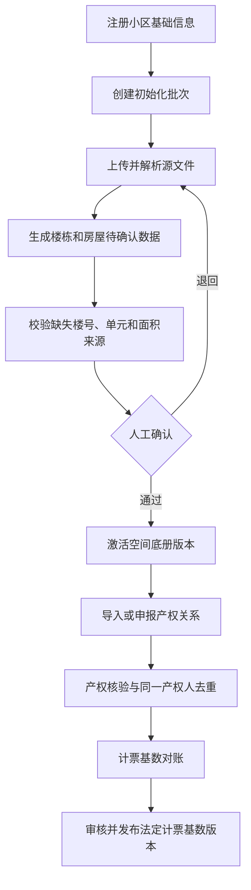
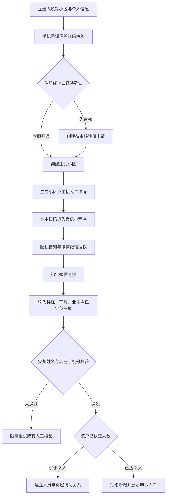
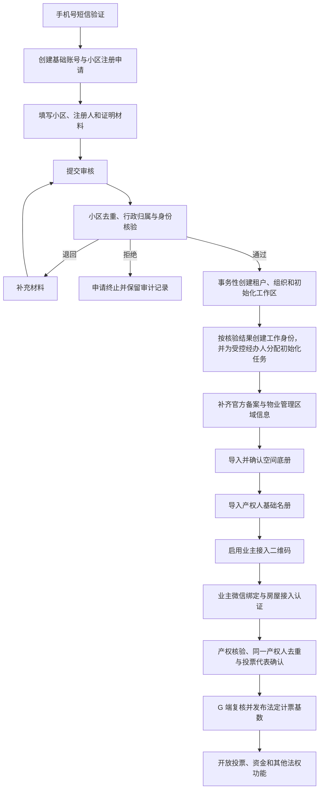

# 小区注册与初始化方案

> 归档声明：本文尚未按当前文档治理标准重新核验，暂不作为权威业务规范。需要恢复该主题时，应基于原始登记资料和现行规则重写。

> **状态**：第一阶段已实现并验证；空间底册、产权名册和业主接入按后续阶段持续更新
>
> **创建日期**：2026-07-12
>
> **最后更新**：2026-07-12
>
> **适用范围**：Pangu 后端、Yaochi 管理端，以及后续与 Shennong App 相关的小区数据使用流程

## 1. 文档目的

本文档专门记录“小区注册”和“小区数据初始化”的需求、背景、业务边界、讨论结论与实施方案。

后续新增需求应继续补充到本文档，并同步维护：

1. 已确认业务事实。
2. 尚待确认的问题。
3. 方案决策及其原因。
4. 对数据模型、接口、权限、审计和前端流程的影响。
5. 实施状态与验证结果。

在关键业务事实未确认前，不根据样例文件或现有接口自行推断正式业务规则，也不直接写入正式小区、产权或计票基数数据。

## 2. 核心术语与边界

### 2.1 小区注册

小区注册负责建立 SaaS 租户及其法定、行政和组织身份，至少包括：

1. 小区名称、租户编码和物业管理区域名称。
2. 省、市、区、街道、居委会等行政归属。
3. 物业地址及物业管理区域边界。
4. 业主大会、业主委员会和过渡期管理组织的备案状态。
5. 初始管理账号、组织、角色和数据范围。

小区注册不能仅凭房屋清单自动推断上述信息。

### 2.2 空间底册

空间底册描述物理空间，主要包括：

1. 分期、楼栋、单元、楼层和房屋。
2. 房号、房屋类型及建筑面积。
3. 住宅、商业、车位、公共部位等空间属性。
4. 数据来源、导入批次、核验状态和历史版本。

空间底册不等于产权名册，不应强制伪造产权人姓名或手机号才能建立房屋。

### 2.3 产权名册

产权名册描述自然人或法人对房屋的产权关系，主要包括：

1. 产权人及其实名身份。
2. 产权人与一个或多个专有部分的关系。
3. 共有产权、代表人和投票代表资格。
4. 权属来源、核验方式、核验人、核验时间和证明材料。

产权关系必须来自可信数据或经过明确的人工核验，不能从房号和面积反推。

### 2.4 法定计票基数

法定计票基数是经过核验、对账、发布并形成版本快照的治理数据，包括：

1. 法定专有部分总面积。
2. 业主总人数。
3. 专有部分数量及纳入、排除规则。
4. 数据来源、统计版本、发布人、发布时间和审计记录。

空间底册导入完成不代表法定计票基数已经生效；两者必须是独立流程。

## 3. 当前样例文件分析

样例文件：`docs/sample/1-80住宅表决票送达情况表.xlsx`

### 3.1 已识别数据

对文件进行只读解析后，得到以下结果：

| 项目 | 结果 |
|---|---:|
| 有数据的工作表 | Sheet1 |
| 空工作表 | Sheet2、Sheet3 |
| 分期 | 一期、二期、三期、四期 |
| 实际住宅楼号 | 74 个 |
| 表格分页区块 | 108 个，同一楼栋可能跨多个区块 |
| 房屋数量 | 2,288 套 |
| 面积合计 | 268,844.60 ㎡ |
| 重复房号 | 未发现 |
| 送达方式、业主签收、日期、送达证明 | 均未填写 |

文件名称虽然是“1-80”，但未出现以下楼号：

`4、13、14、44、77、78`

这些楼号可能是正常跳号、非住宅建筑、公共设施，也可能是源文件漏录，目前不能自行判断。

### 3.2 可以用于初始化的数据

在完成核验后，该文件可以作为以下数据的来源：

1. 分期。
2. 楼栋编号。
3. 房号。
4. 房屋面积。
5. 源文件、源工作表和源行号等追溯信息。

### 3.3 不能从文件确定的数据

该文件不能独立确定：

1. 小区名称、地址、租户编码和行政归属。
2. 楼栋是否存在多个单元，以及房号如何映射到单元。
3. 缺失楼号的真实含义。
4. 房屋面积的数据来源及其是否属于法定专有部分面积。
5. 登记产权人姓名、手机号及共有产权关系。
6. 同一产权人拥有多套房屋时的业主人数去重结果。
7. 商业、车位、公共部位和其他非住宅空间。

## 4. 当前系统现状与差距

### 4.1 当前导入契约

当前“小区空间名册导入”实际上使用的是产权冷启动名册契约，每行要求：

1. 楼栋名称。
2. 单元名称。
3. 房号。
4. 建筑面积。
5. 登记业主姓名。
6. 登记业主手机号。

相关代码：

- `pangu-interfaces/.../PropertyRosterImportRequest.java`
- `pangu-application/.../PropertyBindingApplicationService.java`
- `yaochi/src/app/lib/property-binding.ts`

### 4.2 当前不能直接导入样例文件的原因

1. 样例文件使用合并标题和按楼栋分页的版式，不是当前解析器要求的平铺六列表格。
2. 文件没有登记业主姓名和手机号，而当前后端将两项设为必填。
3. 文件有 2,288 套房屋，当前接口单次最多接收 2,000 行。
4. 文件没有单元信息，当前数据库要求 `unit_name` 非空。
5. 当前模型把空间底册和产权冷启动名册耦合在 `c_property_roster`，不适合仅有房屋空间信息的初始化场景。
6. 该差距已在第一阶段补齐：现已有小区注册申请、属地/平台审核、租户开通、初始工作身份和冷启动工作区的完整闭环。

## 5. 当前合规基线

### 5.1 面积来源

上海现行实践中，专有部分面积应优先按照不动产登记簿记载的面积计算；尚未登记时，才依次使用测绘机构实测面积或房屋买卖合同记载面积。

因此，样例文件中的“面积”在来源未确认前，只能作为待核验空间面积，不能直接发布为法定计票面积。

参考：上海市人民政府《实施〈上海市住宅物业管理规定〉若干意见》

https://www.shanghai.gov.cn/nw26275/20200820/0001-26275_28036.html

### 5.2 业主人数

业主人数不能简单等同于房屋套数。同一买受人拥有一个以上专有部分时，业主人数计算需要去重。

因此，在没有产权人数据的情况下，可以得到房屋数量，不能得到法定业主人数。

参考：最高人民法院关于审理建筑物区分所有权纠纷案件适用法律若干问题的解释

https://gongbao.court.gov.cn/Details/02366bc51bd3f8e9843808ce3eec93.html

## 6. 当前方案结论

### 6.1 总体结论

该样例文件可以用于初始化一个小区的“住宅空间底册”，但不能单独完成以下事项：

1. 小区注册。
2. 产权名册初始化。
3. 业主账号初始化。
4. 法定计票基数发布。

### 6.2 建议初始化流程

### 6.3 实施原则

1. 上传文件先进入暂存批次，不直接写入正式名册。
2. 保留源文件哈希、文件名、工作表、源行号、上传人和上传时间。
3. 解析、校验、确认和激活分别留痕。
4. 重复上传同一文件应可识别，避免生成重复房屋。
5. 激活操作应具备事务性；失败时不得留下半批数据。
6. 不创建虚假业主姓名、手机号、单元或产权关系。
7. 空间底册、产权名册和法定计票基数分别建模、分别授权、分别发布。
8. 已发布版本不得被后续导入直接覆盖；修正应生成新版本并保留历史。

## 7. 待确认事项

| 编号 | 待确认问题 | 状态 |
|---|---|---|
| Q-001 | 小区名称、地址、租户编码及行政归属是什么？ | 待提供 |
| Q-002 | `4、13、14、44、77、78` 号是否正常不存在？ | 待确认 |
| Q-003 | 每栋住宅是否只有一个单元，或另有单元映射资料？ | 待确认 |
| Q-004 | 表中面积来自不动产登记簿、测绘报告、买卖合同还是其他台账？ | 待确认 |
| Q-005 | 是否有独立的产权人/业主名册可用于后续关联？ | 待提供 |
| Q-006 | 本次目标是创建全新租户，还是向已有小区补录空间底册？ | 待确认 |
| Q-007 | 商业、车位、公共设施等非住宅空间是否由其他文件提供？ | 待确认 |
| Q-008 | 谁负责确认初始化结果，是否需要街道、居委会或物业双人复核？ | 待确认 |
| Q-009 | 短信校验通过后的“注册成功”是创建待审核申请，还是立即开通正式小区？ | 已确认：创建待审核申请，G 端通过后创建租户 |
| Q-010 | 业委会主任、副主任、委员和居委会身份分别由谁、依据什么材料核验？ | 部分确认：属地街镇 G 端终审，备案材料字段清单待接口设计细化 |
| Q-011 | 注册阶段是否只填省、市、区，街道和居委会归属在何时补齐并核验？ | 待确认 |
| Q-012 | 管理端预录的“全部住户信息”具体包含哪些字段，来源和授权依据是什么？ | 待提供 |
| Q-013 | 楼栋、室号、业主姓氏是否只是初筛，还会使用名册手机号短信或人工核验作为第二因子？ | 已确认：仅用于定位，绑定需完整姓名和名册手机号匹配，失败转人工核验 |
| Q-014 | 每户最多认证两人时，第二人必须是共有产权人、家庭成员还是产权人授权代理人？ | 已确认：共有产权人或经产权人授权的家庭成员 |
| Q-015 | “一户”是一个 `room_id`、一个产权主体，还是同一家庭在小区内的全部房产？ | 已确认：按一套物理房屋 `room_id` 计算，不限制真实产权人数 |
| Q-016 | 两名认证人的“同等权限”是否包含投票操作权？ | 已确认：不包含；沿用唯一投票代表 |
| Q-017 | 商铺、动迁房、商品房、别墅是否保持一个多选字段，还是拆分用途、房屋来源和建筑形态？ | 已确认：注册阶段作为小区概况标签；空间底册分别记录用途、性质和建筑形态 |
| Q-018 | 业主接入二维码是长期公共码，还是有有效期、批次和撤销能力的注册码？ | 已确认：长期不可猜测场景码，支持停用、换版和重新生成 |
| Q-019 | 微信绑定实际需要哪些信息，各字段的处理目的和保存期限是什么？ | 已确认：仅申请登录标识和业务必需手机号，禁止笼统获取全部微信信息 |

## 8. 后续需求记录格式

后续需求和背景按以下格式追加，避免结论与原始事实混在一起：

| 字段 | 内容 |
|---|---|
| 日期 | 提出或确认日期 |
| 来源 | 用户说明、法规、样例文件、现有系统或其他可信来源 |
| 类型 | 背景 / 需求 / 约束 / 决策 / 待确认 |
| 内容 | 原始事实或明确要求 |
| 影响 | 数据模型、接口、权限、审计、前端、迁移或部署 |
| 状态 | 待确认 / 已确认 / 已否决 / 已实施 / 已验证 |

## 9. 决策记录

| 编号 | 日期 | 决策 | 原因 | 状态 |
|---|---|---|---|---|
| D-001 | 2026-07-12 | 小区注册、空间底册、产权名册和法定计票基数必须拆分处理 | 四类数据的来源、责任主体、核验要求和法律效力不同 | 当前结论 |
| D-002 | 2026-07-12 | 样例文件只作为住宅空间底册候选来源 | 文件包含楼栋、房号和面积，但缺少小区、单元、产权人及面积来源信息 | 当前结论 |
| D-003 | 2026-07-12 | 导入必须先暂存、校验和人工确认，再激活正式版本 | 防止格式误判、重复房屋和未经核验的面积进入治理分母 | 当前结论 |
| D-004 | 2026-07-12 | 不使用虚假姓名、手机号或“默认单元”绕过数据约束 | 这类占位数据会污染产权核验、投票资格和审计链 | 当前结论 |
| D-005 | 2026-07-12 | 同一房屋最多两名线上接入成员可拥有相同的非投票权限，但仅唯一投票代表可以提交表决 | 用户已确认“同等权限”不包含投票操作权，与现有唯一投票代表模型保持一致 | 已确认 |
| D-006 | 2026-07-12 | 小区注册申请由属地街镇 G 端管理员终审；街镇尚未接入平台时，允许平台运营管理员代审 | 高权限身份和小区行政归属不能由注册人自证，同时需要为冷启动阶段保留受控兜底路径 | 已确认 |
| D-007 | 2026-07-12 | 业主接入二维码在小区审核通过、空间底册确认且产权人基础名册激活后生成 | 避免业主扫码后没有可匹配小区、房屋或产权名册 | 已确认 |
| D-008 | 2026-07-12 | 普通业主不得获得初始化材料提交权限 | 小区基础底册和产权名册影响全体业主及法定计票基数，应由经核验的工作身份或受控运营经办人处理 | 已确认 |
| D-009 | 2026-07-12 | 短信验证成功只创建待审核注册申请，G 端审核通过后才创建小区租户 | 手机控制权校验不能替代小区真实性、行政归属和注册人身份核验 | 已确认 |
| D-010 | 2026-07-12 | 注册表单中的房屋类型作为小区概况标签；具体房屋在空间底册中分别记录用途、住房性质和建筑形态 | 注册概况与法定空间数据的粒度和分类维度不同 | 已确认 |
| D-011 | 2026-07-12 | 每户两名接入成员按 `room_id` 限制；第二人仅限共有产权人或经产权人授权的家庭成员 | 线上接入席位不能改变真实产权关系，非投票成员不能取得表决权 | 已确认 |
| D-012 | 2026-07-12 | 楼栋、房号和姓氏只用于定位；房屋绑定需完整姓名和名册手机号匹配，失败转人工材料核验 | 防止仅凭容易获知的信息冒认业主身份 | 已确认 |
| D-013 | 2026-07-12 | 业主接入二维码使用长期不可猜测场景码，服务端支持停用、换版和重新生成 | 兼顾线下长期张贴与泄露、错绑后的撤销能力 | 已确认 |
| D-014 | 2026-07-12 | 微信端只申请登录标识和业务必需手机号 | 遵循目的明确和最小必要原则，不获取笼统的全部微信信息 | 已确认 |

## 10. 实施状态

第一阶段已完成：

1. Pangu 已实现注册申请领域状态机、申请人接口、属地/平台审核接口、私有材料存储与临时预览、权限与审计。
2. 审核通过时事务性创建小区租户、初始化组织、冷启动工作区和经核验的最小工作身份；普通业主不会获得管理工作身份。
3. Yaochi 已接入注册人短信验证、申请填报、材料上传、进度查询，以及 G 端审核队列、材料预览和审核决策。
4. Flyway `V3.73__community_registration_cold_start.sql` 已建立注册申请、概况标签、审核材料、审核决策、冷启动工作区和审计流水。
5. 已验证创建、修改、提交、退回、补充、撤回、通过开通、重复申请、乐观锁和幂等边界。

尚未实施的内容：

1. 未向正式空间底册或产权名册导入样例文件。
2. 未发布任何法定计票基数。
3. 未实现业主接入二维码、微信登录后端、房屋接入成员和产权材料人工核验。
4. 未改造现有空间/产权名册模型；这些属于后续阶段。

## 11. 新增需求：小区注册与微信端业主接入

### 11.1 需求来源

| 字段 | 内容 |
|---|---|
| 日期 | 2026-07-12 |
| 来源 | 用户补充说明 |
| 类型 | 新增需求与业务背景 |
| 状态 | 第一阶段已实施；微信端业主接入、空间底册和产权名册属后续阶段 |

### 11.2 用户提出的业务要求

#### 小区注册信息

1. 省、市、区。
2. 小区名称。
3. 小区地址。
4. 户数。
5. 房屋类型多选：商铺、动迁房、商品房、别墅。

#### 注册人信息

1. 姓名。
2. 身份：业委会主任、业委会副主任、委员、业主、居委会。
3. 手机号。
4. 通过短信验证码校验后确认注册成功。

#### 注册后的业主接入

1. 注册成功后生成该小区的微信端业主接入二维码。
2. 业主扫描二维码后进入微信小程序，并定位到对应小区。
3. 进入小程序后完成微信绑定。
4. 管理端已提前录入小区全部住户信息。
5. 业主输入楼栋、室号和业主姓氏，与预录名册进行校验。
6. 同一小区内，每户最多允许认证两人。
7. 两名认证人具有同等权限，但同一户对同一事项不能重复投票，只能形成一个有效决策意见。

### 11.3 当前流程理解

以下流程仅用于对齐需求，不代表冲突项已经形成最终方案：

### 11.4 必须先处理的合规与安全约束

#### 微信信息授权

“允许使用全部微信信息”不能直接作为产品和技术目标。已确认微信端只申请登录标识和业务必需的手机号；系统应逐项说明处理目的，并提供拒绝、撤回和删除路径。

《中华人民共和国个人信息保护法》第六条要求个人信息处理具有明确、合理目的，限于实现目的的最小范围；基于同意处理时，还需要在充分知情的前提下由个人自愿、明确作出同意。

参考：中国人大网《中华人民共和国个人信息保护法》

https://www.npc.gov.cn/npc/c2/c30834/202108/t20210820_313088.html

因此，目标流程使用“隐私告知 + 按需授权 + 微信登录标识绑定”，不一次性索取笼统的“全部微信信息”。具体接口和隐私清单在实施时还必须按届时微信小程序官方文档复核。

#### 注册人角色核验

短信验证码只能证明注册人当前控制该手机号，不能证明其确实是业委会主任、副主任、委员或居委会工作人员。

上海市 2026 年现行实施意见明确，业主委员会由业主大会选举产生，主任、副主任从委员中推选产生，业主委员会依法产生后向属地街镇办理备案。因此，高权限身份不能通过注册人自选并仅凭短信立即生效。

参考：上海市房屋管理局等部门《关于完善本市住宅小区业主大会、业主委员会规范化建设的实施意见》（沪房物业〔2026〕36号）

https://fgj.sh.gov.cn/wyglgw/20260423/b81adff0389b4a7c9ecb99bc0b3594dc.html

“手机验证成功”和“身份核验通过”拆成两个状态。已确认由属地街镇 G 端管理员终审，街镇未接入时允许平台运营管理员代审；各身份所需备案材料的字段清单在接口设计阶段继续细化。

#### 业主身份初筛

已确认楼栋、室号和业主姓氏只用于定位候选房屋，不能作为正式绑定凭据。正式绑定使用账号完整实名姓名和名册登记手机号进行匹配；匹配失败时转入产权材料人工核验。

实现时还必须满足：

1. 房号和姓氏容易被熟人、邻居或公开材料知悉。
2. 接口若返回“房屋存在但姓氏不匹配”等差异信息，会产生住户信息枚举风险。
3. 系统应使用统一失败文案、尝试次数限制、风控审计和人工申诉入口。
4. 自动匹配失败时不得降级为姓氏匹配，应提交产权材料并进入独立人工审核。

#### 二维码边界

业主接入二维码只负责把用户带入指定小区的接入场景，不能本身代表业主身份或管理权限。二维码中不应直接携带姓名、手机号、房号等个人信息，也不能以可猜测的租户编号作为唯一授权凭证。

### 11.5 “每户两人、一个意见”的业务冲突

用户已确认：“同等权限”不包含投票操作权。目标规则调整为：

1. `房屋接入成员`：同一房屋最多两名，可以拥有相同的公告查看、报修、资料查阅等非投票权限。
2. `产权关系`：按真实产权资料完整登记，不受“两名接入成员”限制，不能因线上席位限制删除或遗漏共有人。
3. `唯一投票代表`：只有当前有效投票代表可以就该房屋提交表决，另一名接入成员不能投票，也不能覆盖代表人的意见。
4. `第二名接入成员`：仅允许共有产权人，或经产权人授权且完成身份核验的家庭成员。
5. 当前 PRD、`PropertyOwnership.isVotingRepresentative`、`VoteSubmissionService` 和 `REPRESENTATIVE_ONLY` 治理策略可以继续沿用。
6. 房屋接入成员与产权关系必须分别建模，避免把家庭成员或受托接入人错误登记为产权人。

该冲突已经解除。唯一投票代表的首次指定和后续变更应继续使用产权代表确认流程，并保留授权与变更审计。

### 11.6 房屋类型字段需要进一步归类

当前多选项混合了不同维度：

1. `商铺` 更接近房屋用途。
2. `动迁房`、`商品房` 更接近房屋来源或住房性质。
3. `别墅` 更接近建筑形态。

已确认注册阶段将这些选项作为“小区概况标签”，仅表达该小区可能包含的房屋类型，不作为具体房屋的法定分类。空间底册对每套房屋分别记录用途、住房性质和建筑形态，不能直接复用注册标签作为正式房屋属性。

### 11.7 对现有系统的初步影响

当前识别出的实现缺口包括：

1. Pangu 已补齐小区注册申请、审核、开通和冷启动工作区编排；空间底册与产权名册编排仍属后续阶段。
2. Pangu 尚无小区业主接入二维码及其场景令牌管理能力。
3. Shennong App 已存在微信登录客户端方法，并调用 `/auth/wechat-login`，但 Pangu 后端尚未实现对应接口。
4. 现有产权冷启动名册要求业主姓名和手机号；需要明确管理端“全部住户信息”的独立导入来源和核验责任。
5. 现有唯一投票代表模型可以继续沿用，但尚缺少独立的“房屋接入成员”模型和每套房屋最多两名接入成员的约束。
6. `业委会副主任` 当前更适合作为业委会届期职务，而不是新增一个永久静态 RBAC 角色；注册信息中的“身份”需要区分自然人身份、工作身份和届期职务。
7. `居委会` 是组织主体，注册人选项需要进一步明确为居委会工作人员、管理员或其他具体工作身份。

### 11.8 冲突记录

| 编号 | 冲突 | 当前处理 | 状态 |
|---|---|---|---|
| C-001 | 短信通过即注册成功，与高权限身份必须核验冲突 | 短信通过只创建待审核申请，G 端通过后创建租户并授权 | 已解决 |
| C-002 | “使用全部微信信息”与最小必要、知情同意要求冲突 | 仅申请登录标识和业务必需手机号 | 已解决 |
| C-003 | 两名认证人同等投票权限，与现有唯一投票代表规则冲突 | 已明确同等权限不包含投票；继续使用唯一投票代表 | 已解决 |
| C-004 | 楼栋、室号、姓氏校验便捷，但不足以单独证明产权或授权关系 | 仅用于定位，完整姓名和名册手机号匹配，失败转人工核验 | 已解决 |
| C-005 | 房屋类型选项混合用途、来源和建筑形态 | 注册时作为概况标签，空间底册分别建模 | 已解决 |
| C-006 | 新需求假设管理端已有完整住户名册，但当前样例文件不含产权人信息 | 需要单独提供住户/产权数据来源 | 待确认 |

### 11.9 本轮结论

本小节保留需求收敛时的历史结论。其中“本轮不修改业务代码和数据库结构”仅适用于当时的方案讨论回合，现已被第一阶段实施结果替代。

1. 小区注册、微信绑定、住户核验和共享决策均属于后端可信业务，不能只由前端控制。
2. 第一阶段关键冲突已解决并落地；空间底册、产权名册和业主接入的数据问题按后续阶段继续确认。

## 12. 小区冷启动与注册人授权方案

### 12.1 设计目标

小区冷启动需要同时解决两个相互独立的问题：

1. 证明“申请注册的小区真实存在，并且没有被重复注册”。
2. 证明“注册人可以代表其申报的身份参与该小区初始化”。

手机号短信验证码只完成账号控制权校验，不能替代上述两个核验。注册、授权和正式启用必须拆成不同阶段。

### 12.2 三种“成功”口径

| 阶段 | 用户可见结果 | 系统结果 | 权限结果 |
|---|---|---|---|
| 账号注册成功 | 手机号验证成功 | 创建基础账号和注册申请 | 只能查看、补充和撤回本人申请 |
| 小区审核通过 | 小区注册申请通过 | 创建小区租户和初始化工作区 | 按核验结果授予工作身份或限时初始化任务 |
| 小区冷启动完成 | 小区可以正式使用 | 空间底册、产权名册、组织备案和计票基数达到启用条件 | 开放对应治理功能并启用业主接入二维码 |

因此，注册页面中的成功提示确定为“手机号验证成功，注册申请已提交”。不能在短信通过后立即授予业委会或居委会管理权限。

### 12.3 授权原则

1. **申请归属不等于业务角色**：注册申请通过 `applicant_account_id` 归属申请人，不为其创建临时高权限角色。
2. **先核验后授权**：小区真实性、行政归属和注册人身份核验通过后，才创建租户内工作身份。
3. **角色与职务分离**：副主任使用 `COMMITTEE_MEMBER` 工作角色和 `VICE_DIRECTOR` 届期职务，不新增副主任静态角色。
4. **初始化任务与长期权限分离**：确需协助录入资料的经核验业委会委员或其他受控工作身份，只获得指定小区、指定批次、指定动作和有效期内的初始化任务，不获得额外长期管理角色；普通业主不得获得该任务。
5. **禁止自审自批**：注册申请人不得审核自己的小区申请、核验自己的高权限身份或发布法定计票基数。
6. **全程审计**：记录授权人账号、授权依据、证明材料标识、授权范围、授权时间、有效期和撤销原因。

### 12.4 注册身份与授权结果

| 注册人申报身份 | 主要核验依据 | 审核通过后的身份 | 初始化权限边界 |
|---|---|---|---|
| 业委会主任 | 属地街镇备案信息、业委会成员名单、届期及主任职务 | `COMMITTEE_DIRECTOR` + `DIRECTOR` | 可维护建筑底册和自治规则草稿；不得修改官方备案归属或发布法定计票基数 |
| 业委会副主任 | 属地街镇备案信息、业委会成员名单、届期及副主任职务 | `COMMITTEE_MEMBER` + `VICE_DIRECTOR` | 默认按委员权限；如需参与初始化，由审核人另行分配限时初始化任务 |
| 业委会委员 | 属地街镇备案信息、业委会成员名单和届期 | `COMMITTEE_MEMBER` + `MEMBER` | 默认只读；如需参与初始化，由审核人分配限时初始化任务 |
| 业主 | 产权名册自动吻合或产权材料人工核验 | C 端业主身份 | 只能维护本人注册申请、申报本人房产，不得提交或处理小区初始化材料 |
| 居委会 | 必须细化为具体工作人员及其既有组织、岗位 | 关联既有 G 端工作身份 | 不根据“居委会”自选项创建管理员；权限由其真实岗位决定 |

上海市 2026 年实施意见明确：业主委员会由业主大会选举产生，主任、副主任从委员中推选，依法产生后向属地街镇备案。平台中的业委会高权限身份应以该备案关系为主要核验依据。

### 12.5 冷启动主流程

### 12.6 二维码启用时点

业主接入二维码不应在手机号验证成功后立即启用。此时系统还没有经过审核的小区、可匹配的房屋和产权人名册，业主扫码后无法完成可靠认证。

建议时点为：

1. 小区申请已经审核通过并创建租户。
2. 空间底册已经确认。
3. 至少一版产权人基础名册已经导入并激活。
4. 二维码使用长期有效且不可猜测的场景码，并在服务端绑定小区、版本和状态，支持停用、换版和重新生成。

计票基数尚未发布时，可以先开放扫码绑定、公告和报修等非投票能力；投票及其他法权功能继续锁定，直到 G 端发布法定计票基数。

### 12.7 冷启动权限矩阵

| 动作 | 注册申请人 | 受控初始化经办人 | 业委会主任 / 物业经理 | G 端审核人 |
|---|---:|---:|---:|---:|
| 查看、补充本人注册申请 | 是 | 否 | 否 | 是 |
| 审核小区和注册人身份 | 否 | 否 | 否 | 是 |
| 创建租户、绑定行政归属 | 否 | 否 | 否 | 是 |
| 上传初始化源文件 | 否 | 按任务范围 | 是 | 是 |
| 解析并修正暂存数据 | 否 | 按任务范围 | 按既有权限 | 是 |
| 激活空间底册版本 | 否 | 否 | 按既有权限并受复核约束 | 是 |
| 修改官方组织备案信息 | 否 | 否 | 否 | 是 |
| 发布法定计票基数 | 否 | 否 | 否 | 是 |
| 启用或撤销业主接入二维码 | 否 | 否 | 建议允许申请 | 最终确认 |
| 分配长期工作身份 | 否 | 否 | 否 | 是 |

该矩阵与现有社区设置权限方向一致：官方备案写入和法定计票基数发布归 G 端，物业经理和业委会主任只能在授权边界内维护资产或自治规则。

### 12.8 建议的业务对象

为避免把流程状态塞入现有租户状态或静态角色，冷启动至少需要以下相互独立的业务对象：

1. `小区注册申请`：保存申请人、小区声明信息、申报身份、材料和审核状态。
2. `小区初始化工作区`：保存各初始化步骤、完成条件、当前版本和阻塞原因。
3. `初始化任务授权`：保存经核验工作身份或受控运营经办人的账号、动作范围、数据范围、有效期和授权审计；禁止授予普通业主。
4. `工作身份授权记录`：保存正式角色、组织、届期职务、核验依据和撤销记录。
5. `房屋接入成员`：保存每套房屋最多两名线上接入成员及状态，不替代产权关系。

现有 `t_tenant_community.status=ACTIVE/DISABLED` 继续表达租户技术启停，不承载注册审核和冷启动步骤；业务功能是否开放由初始化工作区的就绪状态控制。

### 12.9 当前确认状态

1. 已确认：小区注册申请由属地街镇 G 端管理员终审。
2. 已确认：街镇尚未接入平台时，允许平台运营管理员代审；代审必须记录原因、操作人和完整审核材料。
3. 已确认：普通业主不得获得初始化材料提交权限。
4. 已确认：业主接入二维码在产权人基础名册激活后生成，不在短信验证后立即生成。
5. 已确认：第二名房屋接入成员仅限共有产权人或经产权人授权的家庭成员；非投票成员不得提交或修改表决意见。

### 12.10 初始化材料提交主体

普通业主不得提交或处理小区初始化材料。以普通业主身份发起注册申请时，只能填写小区声明信息、提交与本人有关的注册证明、查看审核进度和补充本人申请；小区审核通过后仍只获得 C 端业主身份。

初始化材料只能由以下主体提交：

1. 属地街镇或居委会的经核验 G 端工作身份。
2. 经核验的业委会主任、委员等 B 端工作身份，并受其既有权限或初始化任务范围限制。
3. 经核验的物业经理或物业经办人员，并受本服务组织数据范围限制。
4. 街镇未接入平台时执行代审、代录的平台运营经办人。

其中，业委会委员或其他受控经办人需要额外协助录入时，可以获得按小区、初始化批次、具体动作和有效期限定的初始化任务。该任务不是管理员角色，不得授予普通业主，也不能用于分配长期角色、审核本人材料、激活法定计票基数或绕过独立复核。

所有初始化文件必须进入暂存批次，由独立审核人确认后才能激活。系统应保留提交人、工作身份、文件哈希、源文件、提交时间、退回原因和审核结果；任务在小区冷启动完成、到达截止时间或被审核人撤销时自动失效。

## 13. 开发准入结论

当前规则已经满足第一阶段开发准入条件。第一阶段只实现“小区注册申请、审核、租户创建与初始授权”闭环，不把尚未完成数据核验的空间底册、产权名册和法定计票基数直接写入正式数据。

### 13.1 第一阶段范围

1. 注册人手机号短信验证和基础账号创建。
2. 小区注册申请的创建、补充、提交、退回、通过、拒绝和撤回状态机。
3. 小区名称、地址、行政区划和小区概况标签的录入与重复申请检查。
4. 属地街镇 G 端审核，以及街镇未接入时的平台运营代审和审计。
5. 审核通过后事务性创建小区租户、组织、初始化工作区和经核验工作身份。
6. 主任、副主任、委员、业主和居委会工作人员的身份映射与最小权限控制。
7. 注册申请、身份核验、授权、代审和租户创建的完整审计记录。
8. 后端领域状态机、权限边界、幂等和事务测试，以及管理端与注册端的真实接口接入。

### 13.2 后续阶段

以下事项不阻塞第一阶段，但在相应阶段开始前必须完成确认或提供数据：

1. 空间底册导入：缺失楼号、单元映射、面积来源及非住宅空间资料。
2. 产权人名册：字段、来源、授权依据和完整样例。
3. 业主接入：房屋接入成员、产权材料人工核验、二维码和微信登录后端接口。
4. 法定计票基数：产权去重、复核、版本发布和治理功能解锁。

### 13.3 第一阶段实施结果

1. 注册人使用既有 C 端短信登录取得独立会话，可通过 `/api/v1/community-registrations` 系列接口维护本人申请。
2. 属地街镇和平台受控审核人通过 `/api/v1/admin/community-registrations` 系列接口查询队列并做出退回、拒绝或通过决策。
3. 注册申请与管理端登录使用相互隔离的 Bearer 会话，注册令牌不会覆盖 B/G/S 端工作身份。
4. 材料仅保存私有对象键和摘要，预览使用有效期链接；删除申请材料时同步删除存储对象并留存审计。
5. 已通过 `CommunityRegistrationFlowTest`、权限菜单定向测试和 `mvn -DskipTests package`；Yaochi 已通过 `npm run build`。
6. 已在桌面端和 390 × 844 移动视口验证短信登录、申请提交、材料预览、属地退回、申请人补充/撤回和审核历史展示；联调临时数据已清理。
