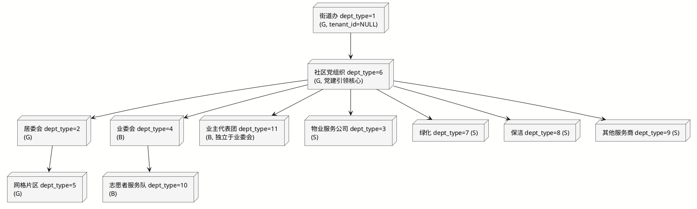
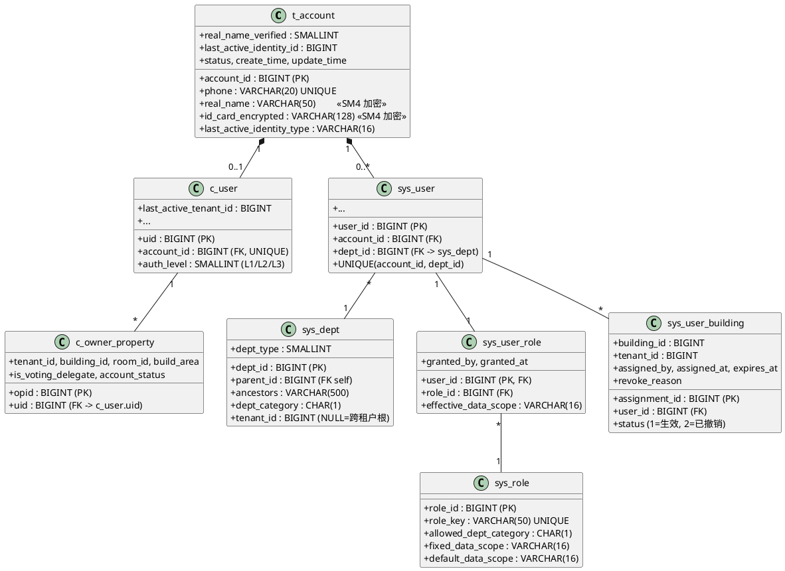
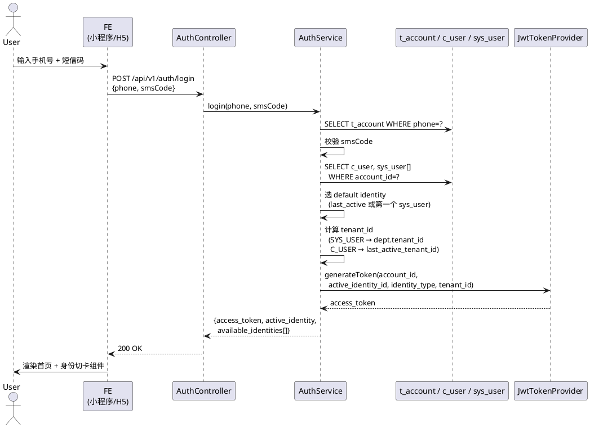
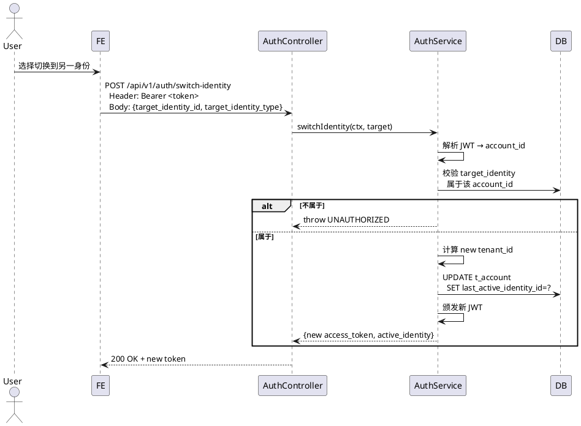
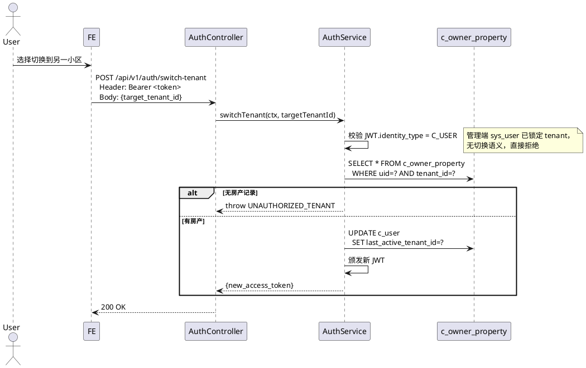
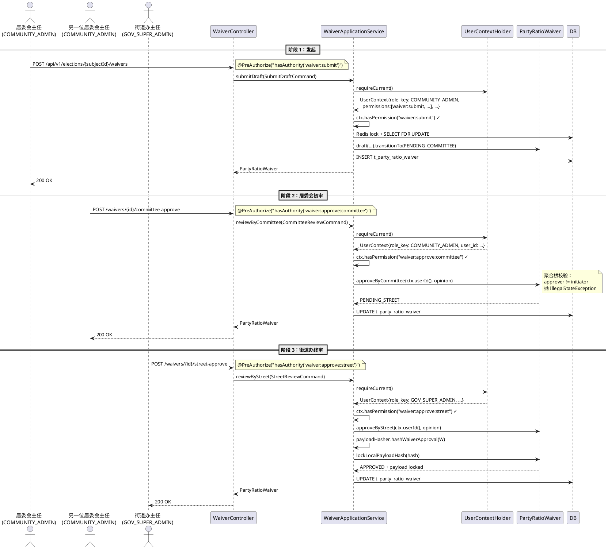

# M1 权限体系重构设计文档

> 归档声明：本文只用于追溯历史重构讨论，其中业务和法理前提未按当前规则复核，不得直接驱动新实现。

> **版本**：v1.1
> **日期**：2026-06-18
> **状态**：已锁定（待实施）
> **适用范围**：M1 开发期 RBAC + ABAC 重构补丁阶段
> **配套源文档**：[权限控制.md](../business/权限控制.md) · [权限矩阵.md](../business/权限矩阵.md)

---

## 0. 阅读须知

### 0.1 文档定位

本文档是 **开发人员维护手册**。承载 M1 阶段（2026-06）就权限体系（RBAC + ABAC + 多端模型 + 自然人聚合 + JWT 切卡 + 法理 trigger 兜底）所做的全部架构裁决。

文档锁定后，代码层任何**与本文档冲突的修改**都需要先反向更新本文档；本文档不得退化为"事后说明"。

### 0.2 目标读者

- **新加入开发人员**：通过本文档建立"为什么 dept_type 不能直接 ==2 比较 / 为什么 sys_user_role 是单列 PK / 为什么 JWT 不嵌 roles"的全局心智模型
- **在职维护人员**：在改动 `WaiverApplicationService` / `DataScopeInterceptor` / `JwtAuthenticationFilter` / V1.x 迁移之前，先在本文档查清相关裁决再动手
- **CR 审阅人员**：以本文档作为准绳判断 PR 是否引入了"被裁决禁止"的设计反模式

### 0.3 与产品文档的关系

```
权限控制.md / 权限矩阵.md         （产品视角，业务规则与法理红线）
              ↓ 落地
M1权限体系重构设计.md            ← 本文档（工程视角，schema/code/trigger）
              ↓ 实施
V1.x 迁移 + Java code             （代码视角，可执行）
```

---

## 1. 背景

### 1.1 业务背景：三端 + 党建引领

中国基层社区治理涉及三类主体，本系统据此抽象为 **G/B/S 三端模型**：

| 端 | 类别 | 说明 | 典型角色 |
|---|---|---|---|
| **G** 端 | 政务监管 | 街道办、居委会、社区党组织、网格片区 | 街道办主任 / 居委会主任 / 党组织书记 / 网格员 |
| **B** 端 | 业主自治 | 业主委员会、业主代表团、志愿者服务队 | 业委会主任 / 业委会成员 / 业委会秘书 / 业主代表 / 志愿者 |
| **S** 端 | 服务供应 | 物业服务公司、绿化养护、保洁服务、其他服务商 | 物业经理 / 物业员工 / 服务商管理员 / 服务商员工 |

党建引领是中国基层治理核心原则：**社区党组织** 是该社区所有治理主体（居委会、业委会、物业、服务商）的领导核心，必须在系统层级中体现为"街道办 → 党组织 → {其余}" 的拓扑形态。

### 1.2 工程现状（重构前）

通过完整代码与 schema 审阅，识别出以下硬伤：

| # | 问题 | 文件 / 位置 | 严重度 |
|---|---|---|---|
| 1 | 缺自然人聚合：`c_user` 既当业主投票主体，又当登录主体 | `c_user`, `JwtAuthenticationFilter`, `AuthService` | 高 |
| 2 | dept_type 硬编码满天飞 | `WaiverApplicationService.java:79` `if (cmd.initiatorDeptType() != 2)` 等 | 高 |
| 3 | DataScopeType 6 枚举与文档定义错位 | `DataScopeType.java` | 高 |
| 4 | `sys_dept` 缺 `tenant_id` 字段 → 多租户隔离基础链断裂 | `V1__init_schema.sql` `sys_dept` 表 | 高 |
| 5 | JWT 内嵌 roles → 角色变更要等 7200s 过期 | `AuthService.login`, `JwtTokenProvider` | 中 |
| 6 | DataScopeInterceptor 多个分支未实现，运行时直接抛 | `DataScopeInterceptor.java:131` | 高 |
| 7 | DataScopeInterceptor `SELF` 业主自查与管理端 sys_role 路径混用 | 同上 | 中 |
| 8 | `AuthService.login` 默认 tenant_id 写死 9001 | `AuthService.java:51` | 高 |
| 9 | sys_user_role N:M 关系语义模糊；无角色↔dept 一致性约束 | `V1.2__sys_user_role.sql` | 高 |
| 10 | 物业被错误归在 B 端 → 与"物业是受托服务商，必须死锁组织内" 法理违和 | `权限控制.md` 与现状代码 | 高 |

### 1.3 法理红线（不可妥协）

来自 [权限控制.md](../business/权限控制.md) 与 [权限矩阵.md](../business/权限矩阵.md) 第三节：

1. **业委会主任** 角色依法必须持有 `ALL_COMMUNITY` 范围，禁止降级为局部
2. **物业** 属于受托企业，必须将其死锁在自己 `org_id` 内部（`ORG_ONLY`）
3. **党建引领**：党组织必须能从拓扑上单向向下俯瞰其他治理主体的业务流水
4. **业主代表 / 楼栋长** 必须死锁到自己那一栋楼（`OWNER_GROUP`），无法越栋偷窥

法理违反 = 系统级合规事故，必须 DB 兜底而非仅靠应用层。

---

## 2. 设计目标

| 目标 | 落实手段 |
|---|---|
| 完全重构，零兼容代码 | M1 dev 期允许重写 V1.x；删除一切已废弃枚举 / 字段 |
| 法理红线 DB 兜底 | sys_role 三字段 + 5 个 PostgreSQL trigger |
| 多层防御不留死角 | Spring Security `@PreAuthorize`（粗粒度 401/403）→ 应用层 RoleGuard（业务语义错误码）→ 领域聚合根（数据相关不变量）→ DB trigger（物理保证） |
| 自然人 / 工作账号解耦 | t_account 薄壳；c_user / sys_user 双挂；JWT 多分身切卡 |
| ABAC 实时性 | JWT 不嵌 roles；UserContext 实时 JOIN + Redis 5min 缓存 |
| 性能不退化 | DataScopeInterceptor 用 ancestors 子查询而非反查 sys_dept；Redis 缓存避免 N+1 |

---

## 3. 核心架构裁决总览

| # | 决策点 | 终态 | 摘要 |
|---|---|---|---|
| 1 | 重构路线 | **路径 B** | 全部重构，不要兼容代码；M1 dev 期 V1.x 可重写 |
| 2 | 端模型 | **G/B/S 三端** | 物业 / 服务商从 B 端剥离到 S 端 |
| 3 | dept 字段形态 | **方案 A 正交** | `dept_category` (G/B/S) + `dept_type` 两字段 + CHECK 约束 |
| 4 | 党组织拓扑 | **党建引领** | 街道办 → 党组织 → {居委会 / 业委会 / 物业 / 业主代表团 / 服务商} |
| 5 | dept_type 枚举 | **11 项** | 1=街道办 / 2=居委会 / 3=物业 / 4=业委会 / 5=网格 / 6=党组织 / 7=绿化 / 8=保洁 / 9=其他服务商 / 10=志愿队 / 11=业主代表团 |
| 5a | sys_role 字段 | **三字段** | `allowed_dept_category` + `fixed_data_scope` + `default_data_scope` + 跨表 trigger |
| 5b | 角色多重性 | **一人一角色** | `sys_user_role.user_id` 单列 PK |
| 5b.1 | 自然人模型 | **方案 X t_account 薄壳** | c_user / sys_user 都挂 t_account；同 account 多 sys_user 分身 |
| 5c | tenant_id 形态 | **三态** | NULL = 跨租户根（街道办 / 跨小区物业总部）；其余 NOT NULL；CHECK + parent-tenant trigger |
| 5d | DataScopeType | **三枚举语义化** | ALL_COMMUNITY / OWNER_GROUP / ORG_ONLY；ancestors 子查询；C 端独立 OwnerSelfFilter |
| 5e | Waiver 校验 | **应用层 UserContextHolder + 角色化** | Command 去 dept_type；@PreAuthorize 粗粒度兜底 |
| 5f | 登录切卡 | **三段式 + 双切换** | login 返回 default + identities[]；switch-identity / switch-tenant 双 endpoint；JWT 不嵌 roles；Redis 5min 缓存 |
| 5g | 楼栋反查 | **sys_user_building 唯一权威** | c_owner_property 解耦；扩字段（assignment_id PK / tenant_id / assigned_by / expires_at / status / revoke_reason） |
| 5h | 三大机制 | **延后 M2** | 仅本期改名 `settle_version → statistics_version`；governance_lock / 注册中心 / W/R/N 全部 backlog |
| 6a | 实施粒度 | **三阶段提交** | feat(rbac) 大原子 + test(rbac) 矩阵 + docs |
| 6b | 工作分支 | **`m1/rbac-rewrite` + PR** | 三个 commit 推进分支后 PR 合 main |
| 6c | 角色 / 权限分层 | **方案 B Permission 模型 schema 就位** | 引入 `sys_permission` + `sys_role_permission`；@PreAuthorize 用 permission_key；管理 endpoint 延后 |
| 6d | UserContextHolder 形态 | **方案 P Bean + ThreadLocal** | 一次请求复用；`JwtAuthenticationFilter.finally` 统一 clear |

---

## 4. 领域模型

### 4.1 部门类型（`dept_type`）与三端归属

```
dept_type 1   街道办事处                    G   跨租户根（tenant_id NULL）
          2   居民委员会                    G   单 tenant
          3   物业服务公司                  S   单 tenant 或 NULL（跨小区集团）
          4   业主委员会                    B   单 tenant
          5   网格片区                      G   单 tenant，居委会下
          6   社区党组织                    G   单 tenant，社区领导核心
          7   绿化养护                      S   同 3
          8   保洁服务                      S   同 3
          9   其他服务商                    S   同 3
          10  志愿者服务队                  B   单 tenant，业委会下
          11  业主代表团                    B   单 tenant，党组织下，独立于业委会
```

CHECK 约束：

```sql
CONSTRAINT chk_dept_category_type CHECK (
    (dept_category = 'G' AND dept_type IN (1,2,5,6))
 OR (dept_category = 'B' AND dept_type IN (4,10,11))
 OR (dept_category = 'S' AND dept_type IN (3,7,8,9))
)
```

### 4.2 部门拓扑（PlantUML）



**关键点**：所有社区下属节点的 `ancestors` 字段中**必须**包含党组织 `dept_id`，使党组织书记调用 `OWN_DEPT_AND_CHILD` 等价路径时，能通过 `ancestors LIKE '%,党组织id,%'` 单向俯瞰整个社区。

### 4.3 角色清单（13 项）

| role_key | dept_category | 限定 dept_type | fixed_data_scope | default_data_scope |
|---|---|---|---|---|
| GOV_SUPER_ADMIN | G | 1 | **ALL_COMMUNITY** ★ | ALL_COMMUNITY |
| COMMUNITY_ADMIN | G | 2 | NULL | ALL_COMMUNITY |
| PARTY_SECRETARY | G | 6 | ALL_COMMUNITY | ALL_COMMUNITY |
| GRID_OPERATOR | G | 5 | OWNER_GROUP | OWNER_GROUP |
| COMMITTEE_DIRECTOR | B | 4 | **ALL_COMMUNITY** ★ | ALL_COMMUNITY |
| COMMITTEE_MEMBER | B | 4 | NULL | ALL_COMMUNITY |
| COMMITTEE_SECRETARY | B | 4 | NULL | ALL_COMMUNITY |
| OWNER_REPRESENTATIVE | B | 11 | **OWNER_GROUP** ★ | OWNER_GROUP |
| VOLUNTEER | B | 10 | NULL | OWNER_GROUP |
| PROPERTY_MANAGER | S | 3 | **ORG_ONLY** ★ | ORG_ONLY |
| PROPERTY_STAFF | S | 3 | **ORG_ONLY** ★ | ORG_ONLY |
| SERVICE_PROVIDER_MANAGER | S | 7/8/9 | ORG_ONLY | ORG_ONLY |
| SERVICE_PROVIDER_STAFF | S | 7/8/9 | ORG_ONLY | ORG_ONLY |

★ 标记：法理红线，DB 锁死，应用层无法降级。

### 4.4 自然人三层模型（`t_account` / `c_user` / `sys_user`）



**关键点**：
- 业务表 FK 不变：`c_owner_property.uid` 仍指 `c_user.uid`，`sys_user_role.user_id` 仍指 `sys_user.user_id`
- `t_account` 是纯薄壳，**不携带任何业务字段**（auth_level / 房产 / dept 都在子表）
- 同 `account_id` 在不同 `dept_id` 注册多个 `sys_user` 分身，`UNIQUE(account_id, dept_id)` 阻止同一 account 在同一 dept 出现多个 user

---

## 5. ABAC 数据范围

### 5.1 三枚举语义

| 枚举 | 含义 | SQL 重写 |
|---|---|---|
| `ALL_COMMUNITY` | 全社区视野 | 仅注 `tenant_id = ?`（如 TenantContext present） |
| `OWNER_GROUP` | 楼栋范围 | 注 `tenant_id = ? AND building_id IN (sys_user_building 反查集合)` |
| `ORG_ONLY` | 组织内部 | 注 `tenant_id = ? AND dept_id IN (own_dept + ancestors LIKE 子树)` |

### 5.2 SQL 重写策略（伪代码）

```java
private String rewriteSql(String sql, DataScope anno, UserSecurityContext ctx) {
    // 1. 共同前缀：tenant_id 注入
    Optional<Long> tenant = TenantContext.get();
    if (tenant.isPresent() && !anno.tenantAlias().isEmpty()) {
        cond.append(anno.tenantAlias()).append(".tenant_id = ").append(tenant.get()).append(" AND ");
    }

    // 2. 按枚举分支
    switch (DataScopeType.of(ctx.getDataScope())) {
        case ALL_COMMUNITY -> {
            // 街道办用户跨租户路径（TenantContext empty）→ 不重写
            if (tenant.isEmpty()) return sql;
            // 同租户全社区 → 仅 tenant_id 限定
        }
        case OWNER_GROUP -> {
            List<Long> bids = ctx.getAuthorizedBuildingIds();
            String idList = bids.isEmpty() ? "-1" : bids.stream().map(String::valueOf).collect(joining(","));
            cond.append(anno.buildingAlias()).append(".building_id IN (").append(idList).append(")");
        }
        case ORG_ONLY -> {
            // 用 ancestors 子查询，不在拦截器内反查 sys_dept
            cond.append(anno.deptAlias()).append(".dept_id IN (")
                .append("SELECT dept_id FROM sys_dept WHERE dept_id = ").append(ctx.getDeptId())
                .append("    OR ancestors LIKE '%,").append(ctx.getDeptId()).append(",%'")
                .append("    OR ancestors LIKE '").append(ctx.getDeptId()).append(",%'")
                .append("    OR ancestors LIKE '%,").append(ctx.getDeptId()).append("'")
                .append(")");
        }
    }
}
```

### 5.3 `@DataScope` 注解形态

```java
public @interface DataScope {
    String tenantAlias()    default "";  // tenant_id 列别名（业务表通常是主表别名）
    String deptAlias()      default "";  // 用于 ORG_ONLY
    String buildingAlias()  default "";  // 用于 OWNER_GROUP
    // 删除 userAlias / userColumn —— C 端业主自查不走 sys_role 路径
}
```

### 5.4 C 端业主自查路径（OwnerSelfFilter）

业主调 `GET /api/v1/owner/properties` 等自查接口：

- **不走** `DataScopeInterceptor`（业主无 `sys_role`）
- 走 `OwnerSelfFilter`：从 JWT 拿 `c_user.uid`，在业务层显式注入 `WHERE uid = ?` 的 mapper 参数
- 业务层 mapper 方法签名 `findPropertiesByUid(Long uid)` 比 SQL 拦截更明确，审计性更好

### 5.5 Permission 模型（RBAC 之上的能力点层）

#### 5.5.1 为什么不让 `@PreAuthorize` 直接绑 role_key

未来 SaaS 管理员要能在管理后台**新建角色 + 自定义角色权限**。如果 `@PreAuthorize("hasRole('COMMUNITY_ADMIN')")` 把 role_key 写死在源码里：

- 新建一个角色 `COMMUNITY_ADMIN_DEPUTY` 想拥有"居委会初审" 权限 → 需要改全部相关 controller 源码
- M1 上线后再做这件事 = 大规模破坏性重构

**正确分层**：

```
代码不变量：permission_key（业务能力点常量，例：waiver:approve:committee）
    ↑ M:N
数据可变量：sys_role（13 system + N custom，可由管理员维护）
    ↑ M:1
sys_user_role（一人一角色）
```

`@PreAuthorize` 永远只看 permission_key，role 怎么变都不影响代码。

#### 5.5.2 `sys_permission` 表

```sql
CREATE TABLE sys_permission (
    permission_key VARCHAR(64) PRIMARY KEY,        -- 'waiver:submit', 'voting:cast', ...
    description VARCHAR(200) NOT NULL,
    permission_group VARCHAR(32) NOT NULL,         -- WAIVER / VOTING / FUND / IDENTITY / ADMIN
    allowed_dept_categories VARCHAR(3) NOT NULL,   -- 'G' / 'B' / 'S' / 'GB' / 'GBS' 字符位组合
    is_legal_redline SMALLINT NOT NULL DEFAULT 0,  -- 1=法理红线（DB trigger 必校验）
    create_time TIMESTAMP NOT NULL DEFAULT CURRENT_TIMESTAMP
);
```

`allowed_dept_categories` 是字符位组合：`'G'` 仅 G 端可拥有；`'GB'` 表示 G 或 B；`'GBS'` 全端可拥有。

#### 5.5.3 `sys_role_permission` 表

```sql
CREATE TABLE sys_role_permission (
    role_id BIGINT NOT NULL REFERENCES sys_role(role_id) ON DELETE CASCADE,
    permission_key VARCHAR(64) NOT NULL REFERENCES sys_permission(permission_key),
    granted_by BIGINT,
    granted_at TIMESTAMP NOT NULL DEFAULT CURRENT_TIMESTAMP,
    PRIMARY KEY (role_id, permission_key)
);
CREATE INDEX idx_role_permission_role ON sys_role_permission(role_id);
```

#### 5.5.4 `sys_role.is_system` 字段

```sql
ALTER TABLE sys_role
  ADD COLUMN is_system SMALLINT NOT NULL DEFAULT 0;  -- 1=预置系统角色不可删, 0=管理员自建
```

13 个预置 role seed 时 `is_system=1`；DELETE trigger 拒绝删除 `is_system=1` 的角色（trigger 7，详见 §8）。

#### 5.5.5 业务能力点目录（M1 范围）

| permission_key | 中文描述 | group | allowed_categories | redline |
|---|---|---|---|---|
| `waiver:submit` | 发起党员比例放宽申请 | WAIVER | G | 1 |
| `waiver:approve:committee` | 居委会初审 waiver | WAIVER | G | 1 |
| `waiver:approve:street` | 街道办终审 waiver | WAIVER | G | 1 |
| `waiver:revoke` | 撤销 waiver | WAIVER | G | 1 |
| `waiver:read` | 查看 waiver 列表 / 详情 | WAIVER | GBS | 0 |
| `voting:subject:create` | 创建投票议题 | VOTING | GB | 0 |
| `voting:subject:publish` | 公示候选人 / 议题 | VOTING | GB | 0 |
| `voting:subject:settle` | 触发结算 | VOTING | G | 0 |
| `voting:cast` | 业主投票 | VOTING | — (C端权限，不走 sys_role) | 0 |
| `candidate:nominate` | 候选人提名 | VOTING | GB | 0 |
| `candidate:approve` | 候选人资格初审 | VOTING | G | 0 |
| `fund:account:read` | 维修资金账户查询 | FUND | GBS | 0 |
| `fund:disclosure:publish` | 财务公示 | FUND | GB | 0 |
| `identity:switch` | 切换工作身份 | IDENTITY | GBS | 0 |
| `identity:tenant:switch` | 切换小区（C 端业主） | IDENTITY | — | 0 |
| `admin:role:read` | 查看角色配置 | ADMIN | G | 0 |
| `admin:role:write` | 编辑角色 / 角色 - 权限关系 | ADMIN | G | 1 |
| `admin:user:assign-role` | 给用户分配角色 | ADMIN | G | 1 |
| `admin:user:building:assign` | 任命楼栋（业主代表 / 网格员） | ADMIN | G | 1 |

C 端权限（业主投票、切租户）走独立路径（OwnerSelfFilter + 自然人 JWT），不挂在 sys_role_permission 里。

#### 5.5.6 13 个 system role 的初始 permission 映射

| role_key | 拥有的 permission |
|---|---|
| GOV_SUPER_ADMIN | waiver:* / voting:subject:settle / candidate:approve / fund:* / admin:* / identity:switch |
| COMMUNITY_ADMIN | waiver:submit / waiver:approve:committee / waiver:revoke / waiver:read / voting:subject:create / voting:subject:publish / candidate:approve / identity:switch |
| PARTY_SECRETARY | waiver:read / voting:* / candidate:* / fund:account:read / fund:disclosure:publish / identity:switch |
| GRID_OPERATOR | waiver:read / voting:subject:publish / candidate:nominate / fund:account:read / identity:switch |
| COMMITTEE_DIRECTOR | voting:subject:create / voting:subject:publish / candidate:nominate / fund:disclosure:publish / fund:account:read / identity:switch |
| COMMITTEE_MEMBER | voting:subject:create / candidate:nominate / fund:account:read / identity:switch |
| COMMITTEE_SECRETARY | voting:subject:create / fund:account:read / identity:switch |
| OWNER_REPRESENTATIVE | candidate:nominate / fund:account:read / identity:switch |
| VOLUNTEER | fund:account:read / identity:switch |
| PROPERTY_MANAGER | fund:account:read / waiver:read / identity:switch |
| PROPERTY_STAFF | fund:account:read / identity:switch |
| SERVICE_PROVIDER_MANAGER | fund:account:read / identity:switch |
| SERVICE_PROVIDER_STAFF | fund:account:read / identity:switch |

V1.4__sys_permission.sql 完整 seed 上述映射。

#### 5.5.7 JWT authorities 装配

```java
// JwtAuthenticationFilter
List<GrantedAuthority> authorities = userContextLoader
        .loadByJwt(claims)
        .getPermissions()                              // ← 不是 role_key
        .stream()
        .map(SimpleGrantedAuthority::new)
        .collect(toList());
```

`UserContextLoader` 装配 `UserContext.permissions` 时执行：
```sql
SELECT permission_key
  FROM sys_user_role ur
  JOIN sys_role_permission rp ON rp.role_id = ur.role_id
 WHERE ur.user_id = ?
```

结果带入 Redis 缓存（key: `auth:identity:SYS_USER:{user_id}`，5 分钟 TTL）。

#### 5.5.8 `@PreAuthorize` 表达式

```java
@PostMapping("/api/v1/elections/{subjectId}/waivers")
@PreAuthorize("hasAuthority('waiver:submit')")
public ApiResponse<WaiverDto> submit(...) { ... }

@PostMapping("/api/v1/waivers/{id}/committee-approve")
@PreAuthorize("hasAuthority('waiver:approve:committee')")
public ApiResponse<WaiverDto> committeeApprove(...) { ... }

@PostMapping("/api/v1/waivers/{id}/street-approve")
@PreAuthorize("hasAuthority('waiver:approve:street')")
public ApiResponse<WaiverDto> streetApprove(...) { ... }
```

未来若 SaaS 管理员新建一个 `COMMUNITY_DEPUTY_ADMIN` 角色，并给它勾上 `waiver:approve:committee` permission，**业务代码 0 改动**自动生效。

#### 5.5.9 法理红线兜底（trigger 6）

`sys_role_permission` BEFORE INSERT/UPDATE：

- 检查 `permission.allowed_dept_categories` 与 `role.allowed_dept_category` 兼容
- 例：`waiver:approve:street` 的 `allowed_dept_categories='G'`，若被挂到 `allowed_dept_category='B'` 的自建角色，trigger 抛错
- `is_legal_redline=1` 的 permission 额外要求：role 的 `fixed_data_scope` 必须 NOT NULL（即必须是 DB 锁定 scope 的角色，不允许范围被运行时修改）

---

## 6. 登录与切卡

### 6.1 JWT Payload 终态

```json
{
  "iss": "pangu",
  "sub": "999912",                     // account_id（自然人主体，审计追溯主键）
  "active_identity_id": 800101,        // sys_user.user_id 或 c_user.uid
  "identity_type": "SYS_USER",         // SYS_USER | C_USER
  "tenant_id": 10001,                  // null = 街道办跨租户视野
  "iat": 1750000000,
  "exp": 1750007200
}
```

**故意删除** `roles`、`permissions`、`userType` —— 由 `JwtAuthenticationFilter` 实时 JOIN 装配，命中 Redis 缓存（TTL 5 分钟）。理由：

1. 一人一角色 → 单值不需要 array
2. 法理实时性：党组织撤销某业委会成员资格 5 分钟内全平台 token 失效
3. JWT 轻量化：移动端流量友好

### 6.2 三段式登录时序图



### 6.3 切卡（跨身份）时序图



### 6.4 切租户（业主跨小区）时序图



### 6.5 Redis 角色缓存策略

- **Cache Key**：`auth:identity:{identity_type}:{identity_id}` （例：`auth:identity:SYS_USER:800101`）
- **Value**：序列化的 `UserContext`（含 role_key / **permissions** / dept / building_ids / tenant_id）
- **TTL**：5 分钟
- **主动 EVICT 时机**：
  - `sys_user_role` UPDATE / DELETE
  - `sys_user_building` UPDATE / DELETE
  - `sys_role.fixed_data_scope` UPDATE
  - `sys_role_permission` INSERT / DELETE（**全 role EVICT**：影响该 role 所有用户）
- **降级**：Redis 不可用时直接 JOIN DB（性能下降但不阻断）

---

## 7. 数据库 Schema 详解

### 7.1 表关系总览

参见 §4.4 PlantUML 类图。

### 7.2 `t_account`（自然人主体）

```sql
CREATE TABLE t_account (
    account_id BIGSERIAL PRIMARY KEY,
    phone VARCHAR(20) NOT NULL UNIQUE,
    real_name VARCHAR(50) NOT NULL,                    -- SM4 加密列
    id_card_encrypted VARCHAR(128),                    -- SM4 加密列
    real_name_verified SMALLINT NOT NULL DEFAULT 0,    -- 0=未实名, 1=已实名
    last_active_identity_id BIGINT,                    -- 切卡用，登录时取 default
    last_active_identity_type VARCHAR(16),             -- SYS_USER | C_USER
    status SMALLINT NOT NULL DEFAULT 1,                -- 1=正常, 2=禁用, 3=注销
    create_time TIMESTAMP NOT NULL DEFAULT CURRENT_TIMESTAMP,
    update_time TIMESTAMP NOT NULL DEFAULT CURRENT_TIMESTAMP
);
CREATE INDEX idx_account_phone ON t_account(phone);
```

### 7.3 `sys_dept`（部门 + 物化路径）

```sql
CREATE TABLE sys_dept (
    dept_id BIGSERIAL PRIMARY KEY,
    parent_id BIGINT REFERENCES sys_dept(dept_id),
    ancestors VARCHAR(500) NOT NULL DEFAULT '',        -- '1,105,101' 物化路径
    dept_name VARCHAR(50) NOT NULL,
    dept_type SMALLINT NOT NULL,                       -- 见 §4.1
    dept_category CHAR(1) NOT NULL,                    -- G/B/S
    tenant_id BIGINT,                                  -- 三态：NULL = 跨租户根
    status CHAR(1) NOT NULL DEFAULT '0',
    create_time TIMESTAMP NOT NULL DEFAULT CURRENT_TIMESTAMP,
    update_time TIMESTAMP NOT NULL DEFAULT CURRENT_TIMESTAMP,

    CONSTRAINT chk_dept_category_type CHECK (
        (dept_category = 'G' AND dept_type IN (1,2,5,6))
     OR (dept_category = 'B' AND dept_type IN (4,10,11))
     OR (dept_category = 'S' AND dept_type IN (3,7,8,9))
    ),
    CONSTRAINT chk_dept_tenant_required CHECK (
        (dept_type IN (1,3,7,8,9))                     -- 街道办 / 跨小区服务商：可 NULL
     OR (dept_type IN (2,4,5,6,10,11) AND tenant_id IS NOT NULL)  -- 单租户主体：必填
    )
);
CREATE INDEX idx_dept_parent ON sys_dept(parent_id);
CREATE INDEX idx_dept_ancestors ON sys_dept(ancestors);
CREATE INDEX idx_dept_tenant ON sys_dept(tenant_id);
```

### 7.4 `sys_user`（管理端工作账号 / 影子分身）

```sql
CREATE TABLE sys_user (
    user_id BIGSERIAL PRIMARY KEY,
    account_id BIGINT NOT NULL REFERENCES t_account(account_id),
    dept_id BIGINT NOT NULL REFERENCES sys_dept(dept_id),
    user_name VARCHAR(50) NOT NULL,
    nick_name VARCHAR(50),
    avatar VARCHAR(255),
    status CHAR(1) NOT NULL DEFAULT '0',
    last_login_time TIMESTAMP,
    create_time TIMESTAMP NOT NULL DEFAULT CURRENT_TIMESTAMP,
    update_time TIMESTAMP NOT NULL DEFAULT CURRENT_TIMESTAMP,

    CONSTRAINT uk_account_dept UNIQUE (account_id, dept_id)
);
CREATE INDEX idx_sys_user_account ON sys_user(account_id);
CREATE INDEX idx_sys_user_dept ON sys_user(dept_id);
```

### 7.5 `c_user`（C 端业主身份）

```sql
CREATE TABLE c_user (
    uid BIGSERIAL PRIMARY KEY,
    account_id BIGINT NOT NULL UNIQUE REFERENCES t_account(account_id),
    auth_level SMALLINT NOT NULL DEFAULT 1,            -- L1/L2/L3 业主语义专属
    last_active_tenant_id BIGINT,                      -- switch-tenant 状态
    create_time TIMESTAMP NOT NULL DEFAULT CURRENT_TIMESTAMP,
    update_time TIMESTAMP NOT NULL DEFAULT CURRENT_TIMESTAMP
);
```

注：原 `c_user.phone` 字段移除，统一从 `t_account.phone` 反查。

### 7.6 `sys_role`（角色 + 三字段约束）

```sql
CREATE TABLE sys_role (
    role_id BIGSERIAL PRIMARY KEY,
    role_name VARCHAR(50) NOT NULL,
    role_key VARCHAR(50) NOT NULL UNIQUE,
    allowed_dept_category CHAR(1) NOT NULL
        CHECK (allowed_dept_category IN ('G','B','S')),
    fixed_data_scope VARCHAR(16)
        CHECK (fixed_data_scope IS NULL OR fixed_data_scope IN
              ('ALL_COMMUNITY','OWNER_GROUP','ORG_ONLY')),
    default_data_scope VARCHAR(16) NOT NULL
        CHECK (default_data_scope IN ('ALL_COMMUNITY','OWNER_GROUP','ORG_ONLY')),
    is_system SMALLINT NOT NULL DEFAULT 0,           -- 1=预置 system role，DELETE trigger 拒绝删除
    status CHAR(1) NOT NULL DEFAULT '0',
    create_time TIMESTAMP NOT NULL DEFAULT CURRENT_TIMESTAMP,
    update_time TIMESTAMP NOT NULL DEFAULT CURRENT_TIMESTAMP,

    CONSTRAINT chk_role_scope_consistency CHECK (
        fixed_data_scope IS NULL OR fixed_data_scope = default_data_scope
    )
);
```

### 7.7 `sys_user_role`（一人一角色）

```sql
CREATE TABLE sys_user_role (
    user_id BIGINT NOT NULL,
    role_id BIGINT NOT NULL REFERENCES sys_role(role_id),
    effective_data_scope VARCHAR(16) NOT NULL,
    granted_by BIGINT,
    granted_at TIMESTAMP NOT NULL DEFAULT CURRENT_TIMESTAMP,
    CONSTRAINT pk_sys_user_role PRIMARY KEY (user_id),  -- ★ 单列 PK
    CONSTRAINT fk_user FOREIGN KEY (user_id) REFERENCES sys_user(user_id) ON DELETE CASCADE
);
```

### 7.8 `sys_user_building`（楼栋反查权威）

```sql
CREATE TABLE sys_user_building (
    assignment_id BIGSERIAL PRIMARY KEY,
    user_id BIGINT NOT NULL REFERENCES sys_user(user_id) ON DELETE CASCADE,
    building_id BIGINT NOT NULL,
    tenant_id BIGINT NOT NULL,
    assigned_by BIGINT,
    assigned_at TIMESTAMP NOT NULL DEFAULT CURRENT_TIMESTAMP,
    expires_at TIMESTAMP,
    status SMALLINT NOT NULL DEFAULT 1,                -- 1=生效, 2=已撤销
    revoke_reason VARCHAR(200)
);
CREATE INDEX idx_user_building_user ON sys_user_building(user_id) WHERE status = 1;
CREATE INDEX idx_user_building_building ON sys_user_building(building_id) WHERE status = 1;
```

---

## 8. Trigger 兜底矩阵

| # | 触发表 | 时机 | 校验 | 执行模式 |
|---|---|---|---|---|
| 1 | `sys_user_role` | BEFORE INSERT/UPDATE | role.allowed_dept_category = user.dept.dept_category；OWNER_REPRESENTATIVE 必 dept_type=11；VOLUNTEER 必 dept_type=10；GRID_OPERATOR 必 dept_type=5 | IMMEDIATE |
| 2 | `sys_user_role` | AFTER INSERT/UPDATE | OWNER_REPRESENTATIVE / GRID_OPERATOR / VOLUNTEER 必有至少 1 条生效的 sys_user_building | **DEFERRED** |
| 3 | `sys_user_role` | BEFORE INSERT/UPDATE | sys_role.fixed_data_scope NOT NULL 时，effective_data_scope 必须等于 fixed | IMMEDIATE |
| 4 | `sys_dept` | BEFORE INSERT/UPDATE | parent_id 的 tenant_id IS NULL 或 = 自身 tenant_id（跨租户根 OR 同 tenant） | IMMEDIATE |
| 5 | `sys_user_building` | BEFORE INSERT/UPDATE | tenant_id = sys_user.dept.tenant_id；街道办 user（dept.tenant_id NULL）禁止任命楼栋 | IMMEDIATE |
| 6 | `sys_role_permission` | BEFORE INSERT/UPDATE | role.allowed_dept_category 必须出现在 permission.allowed_dept_categories 字符位组合内；is_legal_redline=1 时要求 role.fixed_data_scope NOT NULL | IMMEDIATE |
| 7 | `sys_role` | BEFORE DELETE | is_system=1 拒绝删除（预置角色保护） | IMMEDIATE |

### 8.1 Trigger 2 DEFERRED 的必要性

业主代表任命流程在同一事务内：

```sql
BEGIN;
INSERT INTO sys_user_role (user_id, role_id, effective_data_scope)
       VALUES (800102, OWNER_REP_ROLE_ID, 'OWNER_GROUP');
-- 此时 trigger 2 若 IMMEDIATE 会因还没有 sys_user_building 而抛错
INSERT INTO sys_user_building (user_id, building_id, tenant_id, ...)
       VALUES (800102, 3, 10001, ...);
COMMIT;
-- 事务末 trigger 2 校验通过
```

DEFERRED 模式让 trigger 在 `COMMIT` 时才校验，允许同事务内先后插入两张表。

---

## 9. Waiver 申请角色化重构

### 9.1 三阶段时序图



### 9.2 业务动作 ↔ Permission ↔ 兜底映射

| 业务动作 | @PreAuthorize permission | 默认拥有此 permission 的 system role | 兜底 |
|---|---|---|---|
| 发起 waiver | `waiver:submit` | COMMUNITY_ADMIN / GOV_SUPER_ADMIN | sys_role_permission trigger 6（permission.allowed_dept_categories='G'） |
| 居委会初审 | `waiver:approve:committee` | COMMUNITY_ADMIN / GOV_SUPER_ADMIN | 同上 + 聚合根 `approver != initiator` |
| 街道办终审 | `waiver:approve:street` | GOV_SUPER_ADMIN | trigger 6（red line + fixed_data_scope NOT NULL） |
| 撤销 | `waiver:revoke` | COMMUNITY_ADMIN / GOV_SUPER_ADMIN | 同 submit |

### 9.3 Command 对象瘦身

```diff
- public record SubmitDraftCommand(
-     Long subjectId, Long tenantId, Long initiatorUserId, Integer initiatorDeptType,
-     BigDecimal requestedRatio, String reasonText, List<String> reasonEvidenceKeys
- )
+ public record SubmitDraftCommand(
+     Long subjectId,
+     BigDecimal requestedRatio,
+     String reasonText,
+     List<String> reasonEvidenceKeys
+ )
+ // tenantId / initiatorUserId / dept 信息从 UserContext 取
```

类似地：
- `CommitteeReviewCommand` 删 `approverUserId / approverDeptType`
- `StreetReviewCommand` 删 `approverUserId / approverDeptType`
- `RevokeWaiverCommand` 删 `operatorUserId`

### 9.4 三层防御链

```
HTTP 请求
  ↓
Spring Security @PreAuthorize          ← 第一层：粗粒度，401/403（hasAuthority(permission_key)）
  ↓
WaiverApplicationService.permission    ← 第二层：业务语义，友好 ErrorCode（备份兜底）
  ↓
PartyRatioWaiver.approve*              ← 第三层：领域不变量（approver≠initiator）
  ↓
sys_user_role / sys_role_permission    ← 第四层（写）：DB trigger 1+3+6 物理保证
                                          role↔dept↔scope↔permission 一致
```

---

## 10. 实施步骤

### 10.1 三阶段提交策略

#### Commit 1 — `feat(rbac): full rewrite of identity & data-scope foundation`

约 35 个文件 / 4200 行。包含：

**Schema**：V1__init_schema.sql / V1.1__seed_mock_data.sql / V1.2__sys_user_role.sql / V1.3__sys_menu.sql 全部重写；V1.4__sys_permission.sql 新增（permission 表 + role-permission 关联 + 13 system role seed）；V2.0__voting_core.sql `settle_version → statistics_version` 改名

**Domain**：
- `DataScopeType.java` 6 → 3 枚举
- `UserContext.java` 扩字段（accountId / deptCategory / roleKey / **permissions** / effectiveDataScope）+ 助手方法 `hasPermission(String)`
- `UserContextHolder.java` 增 `requireCurrent()`
- `WaiverApplicationException.Reason` 文案改角色

**Infrastructure**：
- `DataScopeInterceptor.java` 三枚举重写 + ancestors 子查询
- `UserContextLoader.java`（新建）+ Redis 缓存 + permission JOIN
- `JwtAuthenticationFilter.java` 重写（新 payload）+ 装载 permissions 为 `GrantedAuthority`
- `JwtTokenProvider.java` `generateToken` 改签名
- 新增 mappers：`AccountMapper` / `SysUserRoleMapper` / `SysUserBuildingMapper` / `SysPermissionMapper` / `SysRolePermissionMapper`
- 新增 entity：`Account` / `SysUserRoleRow` / `SysUserBuildingRow` / `SysPermission` / `SysRolePermission`
- `@DataScope` 注解：增 `tenantAlias`，删 `userColumn` / `userAlias`
- `OwnerSelfFilter.java`（新建，pangu-interfaces）

**Application**：
- `WaiverApplicationService.java` 角色化（兜底 `ctx.hasPermission(...)`）
- 4 个 Command 瘦身
- `AuthService.java` 三段式 login
- `OwnerRepresentativeAppointmentService.java`（新建）

**Domain 聚合根**：
- `PartyRatioWaiver.approveByCommittee/approveByStreet` 删 deptType 参数

**Interfaces**：
- `AuthController.java` 新增 switch-identity / switch-tenant
- `WaiverController` 加 `@PreAuthorize("hasAuthority('waiver:...')")`
- 新 DTO：LoginResponse / IdentityDto / SwitchIdentityRequest

**测试适配**（不改逻辑、只改 mock）：
- `ConcurrentWaiverSubmissionTest` / `ElectionWorkflowIntegrationTest` / `DefaultVotingDenominatorResolverTest` / `ControllerIntegrationTest` / `AppExceptionBehaviorTest` / `DataScopeTest`
- 纯 domain 测试不受影响：`VotingDecisionEngineTest` / `ElectionVotingEngineTest` / `PartyRatioCircuitBreakerTest`

#### Commit 2 — `test(rbac): coverage for triggers, three-scope rewrite, identity switch`

新增测试约 12 文件 / 1800 行：

- `SysUserRoleTriggerTest`：trigger 1 / 2 / 3 各 3-4 用例
- `SysDeptTenantTriggerTest`：trigger 4
- `SysUserBuildingTriggerTest`：trigger 5
- `SysRolePermissionTriggerTest`：trigger 6 + trigger 7（is_system 删除拒绝）
- `DataScopeRewriteTest`：三枚举 SQL 重写
- `AuthServiceMultiIdentityTest`：login / switch-identity / switch-tenant
- `UserContextLoaderRedisCacheTest`：缓存命中 / TTL / EVICT（含 sys_role_permission 变更全 role EVICT）
- `OwnerRepresentativeAppointmentServiceTest`：appoint / revoke 同事务
- `PartyRatioWaiverRoleBasedTest`：dept_type 删除 + permission check 验证

#### Commit 3 — `docs: relax V1.x rewrite rule + log M2 backlog`

- `CLAUDE.md`：V1.x 重写规则松绑（M1 dev 期允许；冻结后 forward-only）
- `findings.md`：M2 backlog 登记（governance_lock / 注册中心 / W/R/N）
- `progress.md`：M1 阶段二总结
- `task_plan.md`：归档 M1 plan + 标注 RBAC 重构补丁阶段
- `M1权限体系重构设计.md`：本文档随 commit 落库

### 10.2 关键风险点

| 风险 | 应对 |
|---|---|
| mock 数据连锁 | t_account 必须先 seed；c_user / sys_user FK 后插入；sys_user_role + sys_user_building 必须同事务 |
| `@DataScope` 注解全部要加 `tenantAlias` | 全代码搜索 `@DataScope` → 逐个补；UI 测试覆盖 |
| `JwtTokenProvider` 签发方法改签名 | 调用点（AuthService.login / switchTenant / 新增 switchIdentity）逐个改；旧 token 失效 → 用户被强制重新登录 |
| 测试基线 | 每个 commit 必须 `mvn -pl pangu-bootstrap -am test` 全绿；建议在分支上跑 3-5 轮 fix-then-test |
| Redis 不可用降级 | UserContextLoader 必须实现 fallback 走 DB；启动时不依赖 Redis 健康检查 |

---

## 11. M2 Backlog（延后实施）

### 11.1 governance_lock 通用机制

```sql
CREATE TABLE t_governance_lock (
    lock_id BIGSERIAL PRIMARY KEY,
    entity_type VARCHAR(32) NOT NULL,      -- FINANCE_DISCLOSURE / ELECTION_DISCLOSURE / FUND_LEDGER_PUBLISH
    entity_id BIGINT NOT NULL,
    locked_by_user_id BIGINT NOT NULL,
    locked_at TIMESTAMP NOT NULL DEFAULT CURRENT_TIMESTAMP,
    lock_payload_hash VARCHAR(64) NOT NULL,
    unlock_signers JSONB,                  -- [{user_id, dept_type, signed_at, signature}]
    unlock_at TIMESTAMP,
    version INT NOT NULL DEFAULT 0,
    UNIQUE (entity_type, entity_id)
);
```

复用 M1 `PartyRatioWaiver` 双签 schema 范式：业委会主任 + 街道办双签解锁。

### 11.2 statistics_version 注册中心

```sql
CREATE TABLE t_statistics_version_registry (
    entity_type VARCHAR(32) NOT NULL,
    entity_id BIGINT NOT NULL,
    version INT NOT NULL,
    published_at TIMESTAMP NOT NULL,
    published_by BIGINT NOT NULL,
    payload_hash VARCHAR(64) NOT NULL,
    PRIMARY KEY (entity_type, entity_id, version)
);
```

前端拉取数据时返回 `ETag = "{entity_type}:{entity_id}:{version}"`，被旁路修改时强制刷新。M1 `t_voting_result.statistics_version` 已经命名对齐，M2 直接挂入注册中心。

### 11.3 财务公示与审计对比（W/R/N 差分）

```sql
CREATE TABLE t_finance_disclosure_snapshot (
    snapshot_id BIGSERIAL PRIMARY KEY,
    tenant_id BIGINT NOT NULL,
    period VARCHAR(20) NOT NULL,           -- '2026Q1' / '2026-06'
    data_payload JSONB NOT NULL,
    statistics_version INT NOT NULL,
    locked_at TIMESTAMP,
    ...
);

CREATE TABLE t_disclosure_audit_compare (
    compare_id BIGSERIAL PRIMARY KEY,
    prev_snapshot_id BIGINT NOT NULL,
    curr_snapshot_id BIGINT NOT NULL,
    diff_json JSONB NOT NULL,              -- W=Write/R=Read/N=NoChange 差分
    audited_by BIGINT,
    audited_at TIMESTAMP
);
```

业主端 `GET /api/v1/disclosures/{id}/compare/{vs_version}` 返回差分。

---

## 附录 A — 术语表

| 术语 | 中文 | 含义 |
|---|---|---|
| RBAC | 基于角色的访问控制 | 通过 `sys_role` + `sys_user_role` 控制能干什么 |
| ABAC | 基于属性的访问控制 | 通过 `DataScopeInterceptor` + `@DataScope` 控制能看什么数据 |
| 三端 | G/B/S 三端 | G=政务监管 / B=业主自治 / S=服务供应 |
| 党建引领 | — | 社区党组织作为所有治理主体的领导核心，体现在拓扑层级 |
| 自然人 | t_account | 物理上的"一个真实人类"，唯一手机号 |
| 影子分身 | sys_user | 同一 account 在不同 dept 注册的工作账号 |
| 切卡 | switch-identity | 同 account 的多个分身 / c_user 之间切换 |
| 切租户 | switch-tenant | 同 c_user 跨多个小区房产之间切换（仅业主） |
| OWNER_GROUP | 楼栋范围 | ABAC scope 之一，通过 sys_user_building 反查 |
| ORG_ONLY | 组织内部 | ABAC scope 之一，通过 sys_dept ancestors 子查询 |
| 物化路径 | ancestors | sys_dept 表中字符串形式的祖先 ID 链，如 `'1,105,101'` |

---

## 附录 B — JWT Payload 示例

### B.1 街道办用户（跨租户俯瞰）

```json
{
  "iss": "pangu",
  "sub": "999001",
  "active_identity_id": 800001,
  "identity_type": "SYS_USER",
  "tenant_id": null,
  "iat": 1750000000,
  "exp": 1750007200
}
```

### B.2 业委会主任（单租户全社区）

```json
{
  "iss": "pangu",
  "sub": "999912",
  "active_identity_id": 800101,
  "identity_type": "SYS_USER",
  "tenant_id": 10001,
  "iat": 1750000000,
  "exp": 1750007200
}
```

### B.3 业主代表（楼栋范围）

```json
{
  "iss": "pangu",
  "sub": "999912",
  "active_identity_id": 800102,
  "identity_type": "SYS_USER",
  "tenant_id": 10001,
  "iat": 1750000000,
  "exp": 1750007200
}
```

### B.4 业主自然人（C 端）

```json
{
  "iss": "pangu",
  "sub": "999912",
  "active_identity_id": 70001,
  "identity_type": "C_USER",
  "tenant_id": 10001,
  "iat": 1750000000,
  "exp": 1750007200
}
```

注：B.2 / B.3 / B.4 是同一 `account_id=999912`（张三）的三个身份，通过 `switch-identity` 切换。

---

## 附录 C — 三端典型 mock 用户（求是小区 tenant_id=10001）

| dept | dept_type | dept_category | 典型用户 | role_key | scope |
|---|---|---|---|---|---|
| 街道办（dept_id=1） | 1 | G | 王街道（user_id=800001） | GOV_SUPER_ADMIN | ALL_COMMUNITY |
| 求是党组织（dept_id=105） | 6 | G | 李书记（user_id=800002） | PARTY_SECRETARY | ALL_COMMUNITY |
| 求是居委会（dept_id=101） | 2 | G | 刘主任（user_id=800003） | COMMUNITY_ADMIN | ALL_COMMUNITY |
| 求是第一网格（dept_id=104） | 5 | G | 陈网格员（user_id=800004） | GRID_OPERATOR | OWNER_GROUP（管 1-3 栋） |
| 求是业委会（dept_id=103） | 4 | B | 周主任（user_id=800101） | COMMITTEE_DIRECTOR | ALL_COMMUNITY ★锁死 |
| 求是业委会 | 4 | B | 钱委员（user_id=800103） | COMMITTEE_MEMBER | ALL_COMMUNITY |
| 求是志愿队（dept_id=106） | 10 | B | 孙志愿者（user_id=800104） | VOLUNTEER | OWNER_GROUP |
| 求是业主代表团（dept_id=110） | 11 | B | 张三（user_id=800102） | OWNER_REPRESENTATIVE | OWNER_GROUP（仅 3 栋） |
| 求是物业项目部（dept_id=102） | 3 | S | 赵经理（user_id=800201） | PROPERTY_MANAGER | ORG_ONLY ★锁死 |
| 求是物业项目部 | 3 | S | 朱员工（user_id=800202） | PROPERTY_STAFF | ORG_ONLY ★锁死 |

c_user 侧：

| account_id | uid | tenant 房产 | auth_level |
|---|---|---|---|
| 999912（张三） | 70001 | 求是 3 栋 101（100㎡） | L3 |
| 999913（李四） | 70002 | 求是 1 栋 502 + 5 栋 201 | L2 |

`account_id=999912` 张三同时持有 sys_user=800102（业主代表分身）和 c_user=70001（业主投票身份），通过 switch-identity 切换。

---

## 文档变更记录

| 版本 | 日期 | 作者 | 变更摘要 |
|---|---|---|---|
| v1.0 | 2026-06-18 | M1 RBAC 重构小组 | 锁定全部裁决，进入实施 |
| v1.1 | 2026-06-18 | M1 RBAC 重构小组 | 引入 Permission 模型（6c 方案 B）：`sys_permission` + `sys_role_permission` + 是 / 否 system role；@PreAuthorize 改用 permission_key；trigger 6+7；UserContext.permissions 字段 |
