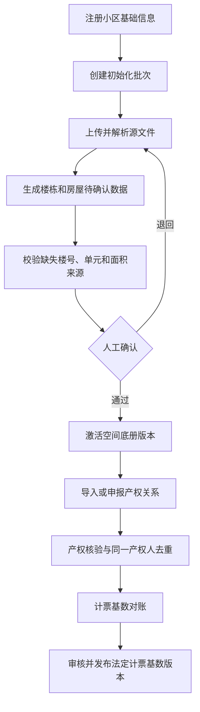

# 小区注册与初始化方案

> **状态**：讨论稿（持续更新）
>
> **创建日期**：2026-07-12
>
> **最后更新**：2026-07-12
>
> **适用范围**：Pangu 后端、Yaochi 管理端，以及后续与 Shennong App 相关的小区数据使用流程

## 1. 文档目的

本文档专门记录“小区注册”和“小区数据初始化”的需求、背景、业务边界、讨论结论与实施方案。

后续新增需求应继续补充到本文档，并同步维护：

1. 已确认业务事实。
2. 尚待确认的问题。
3. 方案决策及其原因。
4. 对数据模型、接口、权限、审计和前端流程的影响。
5. 实施状态与验证结果。

在关键业务事实未确认前，不根据样例文件或现有接口自行推断正式业务规则，也不直接写入正式小区、产权或计票基数数据。

## 2. 核心术语与边界

### 2.1 小区注册

小区注册负责建立 SaaS 租户及其法定、行政和组织身份，至少包括：

1. 小区名称、租户编码和物业管理区域名称。
2. 省、市、区、街道、居委会等行政归属。
3. 物业地址及物业管理区域边界。
4. 业主大会、业主委员会和过渡期管理组织的备案状态。
5. 初始管理账号、组织、角色和数据范围。

小区注册不能仅凭房屋清单自动推断上述信息。

### 2.2 空间底册

空间底册描述物理空间，主要包括：

1. 分期、楼栋、单元、楼层和房屋。
2. 房号、房屋类型及建筑面积。
3. 住宅、商业、车位、公共部位等空间属性。
4. 数据来源、导入批次、核验状态和历史版本。

空间底册不等于产权名册，不应强制伪造产权人姓名或手机号才能建立房屋。

### 2.3 产权名册

产权名册描述自然人或法人对房屋的产权关系，主要包括：

1. 产权人及其实名身份。
2. 产权人与一个或多个专有部分的关系。
3. 共有产权、代表人和投票代表资格。
4. 权属来源、核验方式、核验人、核验时间和证明材料。

产权关系必须来自可信数据或经过明确的人工核验，不能从房号和面积反推。

### 2.4 法定计票基数

法定计票基数是经过核验、对账、发布并形成版本快照的治理数据，包括：

1. 法定专有部分总面积。
2. 业主总人数。
3. 专有部分数量及纳入、排除规则。
4. 数据来源、统计版本、发布人、发布时间和审计记录。

空间底册导入完成不代表法定计票基数已经生效；两者必须是独立流程。

## 3. 当前样例文件分析

样例文件：`docs/sample/1-80住宅表决票送达情况表.xlsx`

### 3.1 已识别数据

对文件进行只读解析后，得到以下结果：

| 项目 | 结果 |
|---|---:|
| 有数据的工作表 | Sheet1 |
| 空工作表 | Sheet2、Sheet3 |
| 分期 | 一期、二期、三期、四期 |
| 实际住宅楼号 | 74 个 |
| 表格分页区块 | 108 个，同一楼栋可能跨多个区块 |
| 房屋数量 | 2,288 套 |
| 面积合计 | 268,844.60 ㎡ |
| 重复房号 | 未发现 |
| 送达方式、业主签收、日期、送达证明 | 均未填写 |

文件名称虽然是“1-80”，但未出现以下楼号：

`4、13、14、44、77、78`

这些楼号可能是正常跳号、非住宅建筑、公共设施，也可能是源文件漏录，目前不能自行判断。

### 3.2 可以用于初始化的数据

在完成核验后，该文件可以作为以下数据的来源：

1. 分期。
2. 楼栋编号。
3. 房号。
4. 房屋面积。
5. 源文件、源工作表和源行号等追溯信息。

### 3.3 不能从文件确定的数据

该文件不能独立确定：

1. 小区名称、地址、租户编码和行政归属。
2. 楼栋是否存在多个单元，以及房号如何映射到单元。
3. 缺失楼号的真实含义。
4. 房屋面积的数据来源及其是否属于法定专有部分面积。
5. 登记产权人姓名、手机号及共有产权关系。
6. 同一产权人拥有多套房屋时的业主人数去重结果。
7. 商业、车位、公共部位和其他非住宅空间。

## 4. 当前系统现状与差距

### 4.1 当前导入契约

当前“小区空间名册导入”实际上使用的是产权冷启动名册契约，每行要求：

1. 楼栋名称。
2. 单元名称。
3. 房号。
4. 建筑面积。
5. 登记业主姓名。
6. 登记业主手机号。

相关代码：

- `pangu-interfaces/.../PropertyRosterImportRequest.java`
- `pangu-application/.../PropertyBindingApplicationService.java`
- `yaochi/src/app/lib/property-binding.ts`

### 4.2 当前不能直接导入样例文件的原因

1. 样例文件使用合并标题和按楼栋分页的版式，不是当前解析器要求的平铺六列表格。
2. 文件没有登记业主姓名和手机号，而当前后端将两项设为必填。
3. 文件有 2,288 套房屋，当前接口单次最多接收 2,000 行。
4. 文件没有单元信息，当前数据库要求 `unit_name` 非空。
5. 当前模型把空间底册和产权冷启动名册耦合在 `c_property_roster`，不适合仅有房屋空间信息的初始化场景。
6. 当前代码中尚未发现完整的小区注册/租户开通应用服务和管理端流程；已有小区主要依赖初始化迁移数据。

## 5. 当前合规基线

### 5.1 面积来源

上海现行实践中，专有部分面积应优先按照不动产登记簿记载的面积计算；尚未登记时，才依次使用测绘机构实测面积或房屋买卖合同记载面积。

因此，样例文件中的“面积”在来源未确认前，只能作为待核验空间面积，不能直接发布为法定计票面积。

参考：上海市人民政府《实施〈上海市住宅物业管理规定〉若干意见》

https://www.shanghai.gov.cn/nw26275/20200820/0001-26275_28036.html

### 5.2 业主人数

业主人数不能简单等同于房屋套数。同一买受人拥有一个以上专有部分时，业主人数计算需要去重。

因此，在没有产权人数据的情况下，可以得到房屋数量，不能得到法定业主人数。

参考：最高人民法院关于审理建筑物区分所有权纠纷案件适用法律若干问题的解释

https://gongbao.court.gov.cn/Details/02366bc51bd3f8e9843808ce3eec93.html

## 6. 当前方案结论

### 6.1 总体结论

该样例文件可以用于初始化一个小区的“住宅空间底册”，但不能单独完成以下事项：

1. 小区注册。
2. 产权名册初始化。
3. 业主账号初始化。
4. 法定计票基数发布。

### 6.2 建议初始化流程

### 6.3 实施原则

1. 上传文件先进入暂存批次，不直接写入正式名册。
2. 保留源文件哈希、文件名、工作表、源行号、上传人和上传时间。
3. 解析、校验、确认和激活分别留痕。
4. 重复上传同一文件应可识别，避免生成重复房屋。
5. 激活操作应具备事务性；失败时不得留下半批数据。
6. 不创建虚假业主姓名、手机号、单元或产权关系。
7. 空间底册、产权名册和法定计票基数分别建模、分别授权、分别发布。
8. 已发布版本不得被后续导入直接覆盖；修正应生成新版本并保留历史。

## 7. 待确认事项

| 编号 | 待确认问题 | 状态 |
|---|---|---|
| Q-001 | 小区名称、地址、租户编码及行政归属是什么？ | 待提供 |
| Q-002 | `4、13、14、44、77、78` 号是否正常不存在？ | 待确认 |
| Q-003 | 每栋住宅是否只有一个单元，或另有单元映射资料？ | 待确认 |
| Q-004 | 表中面积来自不动产登记簿、测绘报告、买卖合同还是其他台账？ | 待确认 |
| Q-005 | 是否有独立的产权人/业主名册可用于后续关联？ | 待提供 |
| Q-006 | 本次目标是创建全新租户，还是向已有小区补录空间底册？ | 待确认 |
| Q-007 | 商业、车位、公共设施等非住宅空间是否由其他文件提供？ | 待确认 |
| Q-008 | 谁负责确认初始化结果，是否需要街道、居委会或物业双人复核？ | 待确认 |

## 8. 后续需求记录格式

后续需求和背景按以下格式追加，避免结论与原始事实混在一起：

| 字段 | 内容 |
|---|---|
| 日期 | 提出或确认日期 |
| 来源 | 用户说明、法规、样例文件、现有系统或其他可信来源 |
| 类型 | 背景 / 需求 / 约束 / 决策 / 待确认 |
| 内容 | 原始事实或明确要求 |
| 影响 | 数据模型、接口、权限、审计、前端、迁移或部署 |
| 状态 | 待确认 / 已确认 / 已否决 / 已实施 / 已验证 |

## 9. 决策记录

| 编号 | 日期 | 决策 | 原因 | 状态 |
|---|---|---|---|---|
| D-001 | 2026-07-12 | 小区注册、空间底册、产权名册和法定计票基数必须拆分处理 | 四类数据的来源、责任主体、核验要求和法律效力不同 | 当前结论 |
| D-002 | 2026-07-12 | 样例文件只作为住宅空间底册候选来源 | 文件包含楼栋、房号和面积，但缺少小区、单元、产权人及面积来源信息 | 当前结论 |
| D-003 | 2026-07-12 | 导入必须先暂存、校验和人工确认，再激活正式版本 | 防止格式误判、重复房屋和未经核验的面积进入治理分母 | 当前结论 |
| D-004 | 2026-07-12 | 不使用虚假姓名、手机号或“默认单元”绕过数据约束 | 这类占位数据会污染产权核验、投票资格和审计链 | 当前结论 |

## 10. 实施状态

当前仅完成需求讨论、样例文件只读分析和现有代码差距识别，尚未执行以下操作：

1. 未创建新小区或租户。
2. 未向数据库导入样例文件。
3. 未修改现有空间/产权名册模型。
4. 未发布任何法定计票基数。
5. 未开始小区注册与初始化功能开发。
