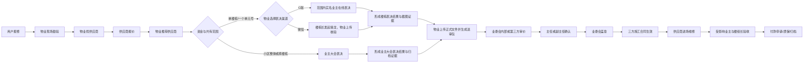
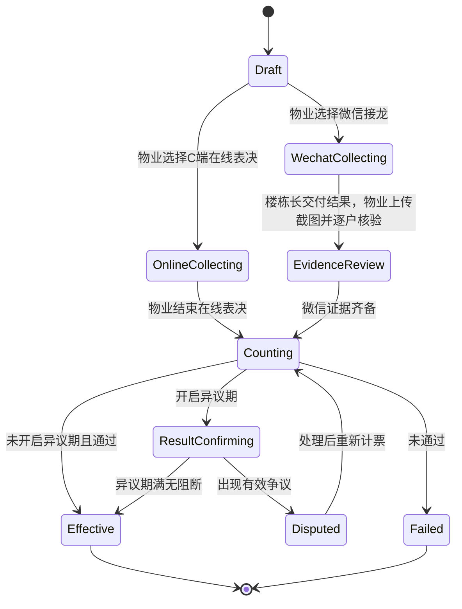
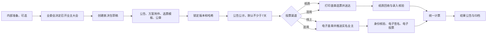

# 报修与业主大会表决流程重构方案

日期：2026-07-10

## 1. 目标

本方案用于重构当前报修流程，并把“单楼栋维修表决”和“业主大会正式表决”拆成两个清晰的业务能力：

1. 报修主流程要贴近真实线下业务：用户报修 -> 物业现场勘验 -> 确定共有和资金范围 -> 供应商报价或长期供应商直接委托 -> 物业形成推荐方案 -> 楼栋接龙或业主大会表决 -> 物业上传正式报审文件并组卷 -> 业委会审价 -> 主任或副主任确认 -> 业委会盖章 -> 三方签订施工合同 -> 供应商进场 -> 受影响业主与楼组长验收 -> 付款申请与归档。
2. 楼栋/一个单元号的维修支持二选一的正式表决渠道：C 端在线表决，或由楼栋长发起微信接龙后交物业上传核验；同一次表决不可混用两个渠道。
3. 业主大会是独立流程，不使用接龙；业主大会支持纸质投票与线上投票两条线，且可混用。
4. 业委会主任或副主任任意一人确认即可进入盖章；确认与盖章必须是两个独立动作并分别留痕。
5. 楼栋维修使用楼栋或单元范围内相关业主的维修资金分户账；小区公共维修使用小区公共维修资金并进入业主大会。
6. 比价是可配置的施工单位选择方式，不是可以被随意关闭的布尔开关。
7. 治理路径由后端根据资金来源和维修范围自动分流，不由物业通过按钮手工决定；物业包干维修进入简化执行路径，楼栋或小区共有资金维修必须进入供应商选择及对应表决流程。

## 2. 依据与现状

### 2.1 样本文档反映的真实材料链

`docs/sample` 中的实际材料体现了以下线下链路：

1. 报修/报批材料通常包含现场问题说明、照片、报价或预算、物业/业委会意见和盖章。
2. 供应商报价单常带现场照片、工程量、总价和公司盖章。
3. 业主大会纸质表决材料包含“送达情况表”，需要按房号、面积、送达方式、签收、日期、送达证明归档。
4. 微信截图、报价单、报批单、盖章页都应作为证据链的一部分，而不是系统外的备注。

### 2.2 本次重构识别出的系统差距

当前 `RepairWorkOrder` 主流程已经覆盖报修、定位、派单、勘验、方案提交、治理审批、施工、验收、评价、归档等状态，但缺少以下关键业务对象：

1. 供应商报价与物业推荐供应商。
2. 单楼栋维修表决决策及其在线/微信渠道。
3. 业委会主任/副主任任意一人确认。
4. 业委会盖章事件。
5. 业主大会的会议、公告、附件、选票、送达、纸质/线上投票、计票和归档。

### 2.3 法规底线

涉及业主共同决定事项时，系统规则不能低于现行法律、地方规定和本小区管理规约。国家法律法规数据库中的《中华人民共和国民法典》是基础依据之一，第二百七十八条规定了业主共同决定事项及参与表决、同意比例的双维度要求。

实施时应把法定底线固化为后端策略守卫：租户配置可以提高要求，不能降低法律、地方规则或小区管理规约要求。

参考：国家法律法规数据库《中华人民共和国民法典》  
https://flk.npc.gov.cn/detail2.html?ZmY4MDgwODE3MjlkMWVmZTAxNzI5ZDUwYjVjNTAwYmY%3D

## 3. 业务边界

### 3.1 报修主流程

报修流程负责“一个维修事项从发现到归档”的生命周期：

### 3.2 单楼栋表决流程

楼栋表决只服务于报修，不进入业主大会模块：

1. 适用范围：楼栋或一个单元内的部分共有维修事项；整栋还是单元范围必须按实际共有关系确定。
2. 渠道选择：物业在发起时选择 `ONLINE` 或 `WECHAT`，选择后不可在同一决策周期内混用。
3. C 端渠道：范围内实名且具有该房屋投票代表资格的业主查看推荐方案、报价与附件，按房屋提交同意、不同意或弃权。
4. 微信渠道：楼栋长在线下微信群发起接龙，完成后将结果交给物业；物业逐户核验并上传原始截图。
5. 证据要求：C 端渠道保存账号、房屋、选择、修改版本和时间审计；微信渠道的截图必须上传，且打印后附在物业给业委会报批的纸质文件后面。
6. 计票要求：两种渠道使用同一份楼栋/单元分母快照，完整记录同意、反对、弃权、无效、未参与，并分别计算人数与专有面积的参与门槛、同意门槛。
7. 生效边界：楼栋表决结果只证明该单楼栋维修事项的业主意思表示，不替代业委会确认与盖章。

### 3.3 业主大会流程

业主大会是独立正式流程，适用于小区整体、跨楼栋、重大改造、依法或依规必须由业主大会决定的事项：

1. 不使用微信接龙。
2. 一个业主大会可以包含多个表决事项。
3. 支持纸质投票、线上投票、纸质与线上混用。
4. 纸质与线上投票必须来自同一个已锁定的公告、附件、选票模板和表决事项版本。
5. 线上投票不是普通按钮，必须形成可审计的电子选票、电子签名、身份核验、时间戳和文件哈希。

## 4. 报修流程重构

### 4.1 建议状态

在现有状态机基础上补齐关键节点：

1. `SUBMITTED`：用户报修。
2. `VERIFIED`：物业确认报修范围、楼栋/单元、责任边界。
3. `SURVEYING`：物业现场勘验中。
4. `SURVEY_COMPLETED`：现场勘验完成，形成勘验记录和照片/视频证据。
5. `QUOTE_COLLECTING`：物业邀请供应商报价。
6. `QUOTE_SUBMITTED`：供应商报价已提交或物业代录。
7. `SUPPLIER_RECOMMENDED`：物业推荐供应商和维修方案。
8. `LOCAL_DECISION_PENDING`：单楼栋表决中，渠道已经锁定。
9. `ASSEMBLY_DECISION_PENDING`：业主大会表决中。
10. `LOCAL_DECISION_PASSED`：楼栋表决通过，待物业成文。
11. `APPROVAL_DOCUMENT_PREPARING`：物业制作并上传正式报审文件。
12. `GOVERNANCE_PENDING`：完整送审包已向业委会送审。
13. `PRICE_REVIEW_PENDING`：待业委会内部审价或第三方专业审价。
14. `GOVERNANCE_CONFIRMED`：主任或副主任已确认。
15. `SEALED`：业委会已盖章。
16. `CONTRACT_SIGNING`：业主大会/业主小组、物业服务企业、施工单位三方签署中。
17. `CONTRACT_EFFECTIVE`：三方签署完成。
18. `IN_PROGRESS`：供应商进场维修。
19. `PENDING_ACCEPTANCE`：待受影响业主与楼组长验收。
20. `ACCEPTANCE_EXCEPTION`：存在无法联系或无法正常签署的受影响业主。
21. `RECTIFICATION_REQUIRED`：任一受影响业主提出明确整改要求。
22. `COMPLETED`：验收完成。
23. `ARCHIVED`：证据链、合同、验收、支付材料归档完成。

方案提交后的自动分流规则：

1. `PROPERTY_INTERNAL`：属于物业包干成本，提交维修范围后直接进入 `APPROVED`，不设置供应商公开限价，也不出现治理路径判定动作。
2. `BUILDING_MAINTENANCE_FUND`：进入供应商选择，定商后只能发起楼栋/单元接龙。
3. `COMMUNITY_MAINTENANCE_FUND` 或 `PUBLIC_REVENUE`：进入供应商选择，定商后只能关联业主大会表决。
4. 后端不再提供从 `PLAN_SUBMITTED` 直接跳到 `GOVERNANCE_PENDING` 或 `APPROVED` 的人工路径接口。

### 4.2 供应商报价

建议新增供应商报价能力，而不是把报价塞进维修方案备注：

1. 默认至少邀请三家供应商；报价截止时有效回复不足三家的，可延期或填写“询价不足说明”后继续。
2. 施工单位选择方式包括多方比价、长期/框架供应商、直接委托和紧急指定；“是否比价”不做成可任意关闭的布尔开关。
3. 长期供应商由物业发起申请，主任或副主任任意一人确认，按小区、服务类别和有效期生效。
4. 单一来源与询价后回复不足是两类不同例外，都必须留存原因和依据。
5. 供应商可自行提交报价；物业也可以代录纸质、微信或 PDF 报价。
6. 物业代录时必须保留原始附件，并记录代录人、代录时间和来源。
7. 有供应商盖章或签字原件的代录报价可标记为 `OFFLINE_EVIDENCE_VERIFIED`；只有微信文字或口头报价的，标记为 `PENDING_SUPPLIER_CONFIRMATION`。
8. 未线上确认的报价可进入比较，但签约前必须有线上确认、纸质盖章/签字原件或合同确认之一。
9. 物业只能做“推荐供应商”，不能在业委会确认、盖章和合同生效前让供应商进场。

建议对象：

1. `RepairSurveyReport`：现场勘验记录、照片/视频、问题原因、维修建议。
2. `RepairSupplierQuote`：供应商、金额、报价明细、附件、提交方式、确认状态。
3. `RepairSupplierRecommendation`：物业推荐的报价、推荐理由、比价说明、是否单一来源。

### 4.3 供应商组织与账号

1. 供应商组织复用现有 `sys_dept` S 端组织能力，以扩展表保存统一社会信用代码、营业执照、认证状态等法律主体资料，不另造一套平行用户体系。
2. 物业可登记并邀价，但企业初始为 `PENDING_VERIFICATION`；统一社会信用代码全平台唯一，企业认证由独立审核完成。
3. 邀请激活页中的企业名称和统一社会信用代码来自邀请并只读展示，不允许被邀请人自由绑定其他企业。
4. 首次激活默认只授予“报价经办人”；企业管理员须额外提交企业授权材料并通过审核。
5. 供应商使用独立工作台，不进入物业和业委会综合后台，不得查看其他供应商报价、业主个人信息和维修资金余额。
6. 物业登记供应商后可为企业联系人或指定经办人创建限时激活邀请；邀价时若联系人尚无本企业工作身份，系统自动确保存在一条有效邀请。
7. 激活以“邀请编号 + 受邀手机号 + 一次性短信验证码 + 经办人姓名”校验，不生成默认密码；邀请只能使用一次，过期、撤销或手机号不一致均拒绝激活。
8. 激活时创建或复用手机号唯一的 `t_account`，再为该自然人在供应商 `sys_dept` 下创建独立 `sys_user` 并绑定 `SERVICE_PROVIDER_STAFF`；同一企业可有多个个人账号，报价审计记录具体 `user_id`。
9. 激活完成后仍通过统一登录接口签发会话，不由激活接口直接返回 JWT；供应商工单可见性继续按企业 `dept_id + quote_invitation` 收口。
10. 物业首次登记供应商时只要求企业名称；统一社会信用代码、联系人和手机号可以稍后补充。资料缺失不阻塞维修邀价和物业代录报价，但系统不自动创建账号激活邀请，企业核验及签约前必须补齐法定主体资料。
11. 企业主体核验与个人账号激活是两条独立状态：企业状态用于判断法律主体是否具备签约资格，账号状态只表示受邀经办人能否登录供应商工作台；账号已激活不代表企业已核验。
12. 物业端分别展示企业核验状态和账号状态。待激活时展示邀请编号与受邀手机号，已激活时展示实际登录手机号和账号数量；邀价自动创建邀请后必须立即回显，避免物业误以为供应商可直接使用企业名称登录。
13. 首次邀价完成后，主动作固定显示为已完成；确需扩大询价范围时，通过独立的“追加邀价供应商”动作选择尚未受邀的企业并填写原因，不覆盖首次邀价记录，也不得重复邀请同一企业。

### 4.4 正式报审文件与送审包

1. 物业上传的正式文件是法定业务材料，系统生成文件仅是模板和草稿辅助。
2. 物业报审模板由物业服务企业提供，业委会审价/盖章页由业委会提供，银行或主管部门表单必须使用签发机构当前版本。
3. 正式文件、勘验材料、报价/长期合作依据、接龙结果、微信截图分别保存原件，系统按固定顺序生成附件目录、连续页码和合并 PDF。
4. 送审后锁定每个原件和整包哈希；补充或修改必须生成新版本，不得覆盖已送审版本。
5. 上传文件不得反向覆盖结构化报价、资金范围和表决结果；不一致时必须返回修正或进入显式差异核对。

### 4.5 业委会审价、确认与盖章

实际规则：

1. 业委会主任或副主任任意一人确认即可。
2. 副主任不应做成固定 RBAC 角色；应是业委会届期中的职务属性。
3. 盖章可由主任、副主任或业委会成员执行。
4. 同一个人可以既确认又盖章，但系统必须记录两个独立事件。
5. 未确认不得盖章；未盖章不得进入正常施工。
6. 审价分为 `INTERNAL_PRICE_REVIEW` 和 `THIRD_PARTY_COST_AUDIT`；小区维修资金规约、法规/银行要求、业主决议或业委会风险判断可触发第三方审价。

建议对象：

1. `RepairGovernanceApproval`：确认人、确认职务、确认意见、确认时间。
2. `GovernanceSealEvent`：盖章人、盖章方式、章类型、盖章文件、盖章时间。

### 4.6 施工合同

1. 楼栋维修不进入业主大会会议流程，但动用维修资金后仍由业主大会/业主小组、物业服务企业、施工单位三方签订施工承包合同。
2. 支持线上、线下和混合签署；三方完成前为 `SIGNING`，不得正常开工。
3. 合同供应商、维修范围和资金来源必须与盖章送审包一致。
4. 合同降价且范围不变可继续；增价、换供应商或扩大范围必须重新报批，影响资金分摊或业主权益时还必须重新表决。

### 4.7 完工验收

1. 资金表决范围与工程验收范围分离：前者是承担共同资金的全部相关业主，后者是实际受影响房屋业主与楼组长。
2. 勘验或实施方案阶段锁定 `affectedRoomIds`，不得用整栋表决名单直接充当验收名单。
3. 正常验收由每个受影响房屋的一名业主代表与楼组长签署；物业代表和业委会代表是可选参与人，不承担楼栋业主的最终验收责任。
4. 任一受影响业主明确要求整改，整体进入 `RECTIFICATION_REQUIRED`，不得被多数决或其他代表覆盖。
5. 不能到场的受影响业主可授权他人或远程签署；无法联系且无明确异议的，进入 `ACCEPTANCE_EXCEPTION`，不自动视为同意。
6. 异常验收必须保留通知记录、现场照片和检测结果，由楼组长与物业代表共同确认，业委会代表仍为可选见证人。

### 4.8 付款与账务边界

1. 报修模块管理合同金额、付款节点、工程进度、验收结果、审价报告和发票等付款条件。
2. 财务模块负责维修资金支取申请、审批、银行凭证、实际付款和分户账分摊。
3. 报修模块只生成预付款、进度款、验收款和质保金付款申请，不直接执行银行支付。
4. 付款失败或退回是独立财务状态，不篡改已发生的工程事件。

### 4.9 紧急维修

1. 紧急维修是独立例外路径，只适用于危及房屋安全、正常使用或人身财产安全等法定紧急情形。
2. 物业可立即采取止水、停电、围挡、停梯等应急防范措施，不等待接龙或业主大会。
3. 后续正式维修必须上传危险证明、现场证据和应急记录，制定方案，向业委会和房管机构报告，并完成专业审价。
4. 可直接指定具备资格的应急供应商，但必须记录原因，不得把紧急路径作为普通维修的快速通道。
5. 完工后仍由受影响业主与楼组长验收，付款和归档规则不豁免。

## 5. 单楼栋表决决策

### 5.1 状态

### 5.2 计票规则

1. 以本次维修涉及的楼栋/单元为表决范围。
2. 分母来自系统业主、房屋、面积快照，而不是微信群人数。
3. 一套房屋只形成一个有效表决权重。
4. 主业主或已登记代表优先；共有人意见冲突时进入待确认，不直接计入有效同意。
5. 每户完整记录 `AGREE` / `DISAGREE` / `ABSTAIN` / `INVALID` / `NOT_VOTED` / `CONFLICTED`，不允许只录入同意数。
6. 法定最低规则是参与表决人数和面积均达总数三分之二，同意人数和面积均超过实际参与部分的二分之一。
7. 小区策略可以配置更高门槛，不能低于法律、地方规定或管理规约底线。

### 5.3 证据规则

1. 微信渠道的截图是原始证据，必须由物业上传；C 端渠道不要求微信截图。
2. 系统应记录截图所属微信群、截图时间、上传人、上传时间、覆盖楼栋/单元。
3. 截图应关联到结构化接龙明细，不能只作为一个附件挂在工单上。
4. 物业报批前必须标记“截图已打印并附后”或上传已盖/已附材料扫描件。
5. 微信渠道的截图和打印件缺失时，即使达到票数也不能推进到业委会确认。
6. C 端和微信接龙是互斥的正式表决来源；选择微信后，普通业主不再在 C 端重复投票。
7. 选择 C 端后，已实名且具有投票代表资格的业主在 `shennong-app` 查看推荐方案、报价和附件，并按其房屋提交或修改选择。
8. 微信渠道由楼栋长线下发起，物业在 `yaochi` 上传截图、代录并核验逐户结果，必须保留来源和操作审计。

### 5.4 建议对象

1. `RepairLocalDecision`：接龙决策主表，绑定报修工单、楼栋/单元、策略、状态、计票结果。
2. `RepairLocalDecisionScopeSnapshot`：本次接龙的房屋、业主、面积分母快照。
3. `RepairSolitaireEntry`：从接龙中识别出的每户选择、原始文本、核验状态。
4. `RepairSolitaireEvidence`：微信截图、打印件、核验附件、送达或异议材料。
5. `RepairLocalDecisionResult`：人数、面积、同意/反对/弃权/无效统计和最终结论。

## 6. 业主大会表决

### 6.1 上层模型

建议把业主大会作为正式独立模块：

1. `OwnersAssemblySession`：一次业主大会。
2. `BallotPackage`：本次业主大会锁定的公告、附件、选票模板、公章和哈希。
3. `VotingSubject`：一个具体表决事项。
4. `VoteRecord`：某业主/房屋对某事项的表决记录。
5. `DeliveryRecord`：纸质送达或线上推送记录。

### 6.2 流程

### 6.3 内部准备模式

内部准备可做成可选项：

1. 完整模式：系统内记录业委会、居委会、物业、设计或服务单位的内部讨论、候选方案、报价、会议纪要和过程附件。
2. 快速模式：线下已完成准备时，直接创建业主大会表决包草稿，上传公告、方案附件、选票模板和会议决定材料。

无论使用哪种模式，正式链路不能跳过：决定召开、表决包、公告公示、投票送达或推送、回收或签名、计票、结果归档。

### 6.4 纸质投票

纸质投票链路：

1. 从已锁定表决包生成纸质选票 PDF。
2. 业委会盖章。
3. 打印并送达到每个业主。
4. 业主纸质勾选、签名。
5. 回收后录入系统。
6. 录入应支持双人复核或抽检复核。
7. 送达情况表、签收页、选票扫描件归档。

### 6.5 线上投票

线上投票链路：

1. 从同一个已锁定表决包生成电子选票。
2. 业委会加盖电子公章。
3. 推送到实名绑定的业主账号。
4. 业主完成身份核验。
5. 业主阅读公告、方案附件和表决事项。
6. 业主电子签名并提交选择。
7. 系统记录签名数据、提交时间、设备/渠道、文件哈希和表决包版本。

线上投票的核心不是“提交选择”，而是形成可核验、可追溯、可归档的电子选票。

### 6.6 纸质与线上混用

混用规则：

1. 同一业主/房屋只能有一张有效票。
2. 纸质票和线上票必须对应同一表决包版本。
3. 投票截止前，实名线上票优先于已回收但尚未最终锁定的纸质票。
4. 投票截止后锁定，不再接受替换。
5. 系统必须保留被替换纸质票的作废原因和证据。

### 6.7 表决包锁定

公告、方案附件、选票模板、表决事项、电子章或印章扫描件一旦发布，应锁定版本和哈希：

1. 投票开始后不得直接修改。
2. 重大错误只能作废当前表决包，重新公告、公示、送达或推送、投票。
3. 小错误是否可补正，应按当地规则和小区管理规约配置，但必须保留补正公告和版本差异。

## 7. 策略配置

建议保留配置能力，但配置必须受后端规则约束：

| 配置项 | 建议值 | 说明 |
| --- | --- | --- |
| `localRepairDecisionPolicy` | `ONLINE_OR_WECHAT_FORMAL_DECISION` | 单楼栋维修在 C 端在线表决与微信接龙中二选一 |
| `localRepairDecisionChannels` | `ONLINE,WECHAT` | 租户可开放的渠道集合，单次决策只能选择一个 |
| `localRepairAllowedScope` | `BUILDING_OR_UNIT` | 按实际部分共有关系锁定整栋或单元 |
| `localRepairObjectionWindowEnabled` | 可选 | 是否开启接龙结果异议期 |
| `localRepairObjectionWindowHours` | 可选 | 异议期小时数，启用时必填 |
| `quoteMinimumInviteCount` | `3` | 默认至少邀请三家，不强制必须收到三份有效报价 |
| `supplierSelectionMethods` | 多选 | `COMPETITIVE_QUOTATION` / `FRAMEWORK_SUPPLIER` / `DIRECT_AWARD` / `EMERGENCY_APPOINTMENT` |
| `thirdPartyPriceReviewRule` | 规约驱动 | 不统一写死金额，由小区规约、法规/银行和业主决议触发 |
| `governanceConfirmRule` | `DIRECTOR_OR_VICE_DIRECTOR` | 主任或副主任任意一人确认 |
| `sealAfterConfirmOnly` | `true` | 未确认不得盖章 |
| `assemblyPreparationMode` | `FULL` 或 `QUICK` | 是否记录内部准备阶段 |
| `assemblyVotingChannels` | `PAPER_ONLY` / `ONLINE_ONLY` / `PAPER_AND_ONLINE` | 业主大会投票渠道 |
| `assemblyPublicNoticeDays` | 不少于 7 | 可配置更长，不能低于底线 |
| `onlineVotePriorityBeforeDeadline` | `true` | 截止前实名线上票优先 |

如果后续其他小区只把接龙作为“前置民意与送达证据”，可切换 `localRepairDecisionPolicy` 为 `SOLITAIRE_AS_PRE_EVIDENCE`。该策略下接龙不产生正式生效结果，必须再进入纸质或线上正式表决。

## 8. 权限与身份

### 8.1 角色

1. `OWNER`：普通业主，只使用 `shennong-app` C 端，不登录 `yaochi` 后台。
2. `OWNER_REPRESENTATIVE`：楼组长/楼栋代表，通过 `shennong-app` 工作身份发起本楼栋/单元接龙、上传截图并组织验收。
3. `PROPERTY_STAFF`：物业经办，勘验、代录报价、上传材料、送审。
4. `PROPERTY_MANAGER`：物业负责人，推荐供应商和提交报批。
5. `SERVICE_PROVIDER_MANAGER`：供应商企业管理员，经授权审核后管理本企业成员。
6. `SERVICE_PROVIDER_STAFF`：报价经办人，在独立供应商工作台处理本企业邀价和报价。
7. `COMMITTEE_MEMBER`：业委会成员，可盖章或参与材料处理。
8. `COMMITTEE_DIRECTOR`：业委会主任，可确认。

### 8.2 职务

副主任不要做成静态角色。建议在业委会届期成员表中增加职务：

1. `DIRECTOR`
2. `VICE_DIRECTOR`
3. `MEMBER`

确认权限由“当前届期有效成员 + 职务为主任或副主任”判断。

## 9. 审计与归档

每一个具有法律或治理效果的动作都应形成审计事件：

1. 报修提交。
2. 物业现场勘验。
3. 供应商报价提交或物业代录。
4. 物业推荐供应商。
5. 物业选择并锁定楼栋表决渠道。
6. C 端逐户表决及修改，或微信接龙截图上传、逐户核验和打印附后。
7. 楼栋表决计票结果生成。
8. 业主大会表决包锁定。
9. 纸质送达、回收、录入、复核。
10. 线上推送、身份核验、电子签名、提交。
11. 主任或副主任确认。
12. 业委会盖章。
13. 供应商进场。
14. 三方合同签署和补充协议。
15. 受影响业主、楼组长及可选见证人验收。
16. 整改、验收异常、付款申请、质保和归档。

归档包应能导出：

1. 工单基础信息。
2. 勘验记录和照片/视频证据。
3. 报价与比价材料。
4. 物业推荐说明。
5. 单楼栋在线表决审计，或微信接龙截图、结构化核验结果和打印附件记录；小区公共维修则归档业主大会表决材料。
6. 主任/副主任确认记录。
7. 盖章文件。
8. 施工、验收、支付材料。

## 10. 实施切片

当前分支已经按垂直切片接入：

1. 供应商组织、租户合作关系、限时一次性账号激活、个人工作身份、邀价、供应商独立工作台、供应商在线报价和物业代录报价。
2. `COMPETITIVE_QUOTATION`、`FRAMEWORK_SUPPLIER`、`DIRECT_AWARD`、`EMERGENCY_APPOINTMENT` 四种施工单位选择方式。
3. 整栋/单元接龙分母锁定、逐户完整选择、微信截图证据、双维度计票和接龙结果状态。
4. 物业正式报审文件、不可变合并包、附件顺序和版本锁定。
5. 业委会内部审价或第三方专业审价、主任/副主任任一确认、独立盖章。
6. 三方合同线上/线下/混合签署、合同生效后开工。
7. 受影响房屋、受影响业主、楼组长、物业/业委会可选见证、整改和失联例外。
8. 维修模块付款申请与财务执行边界。
9. `yaochi` 物业/业委会操作页、供应商独立工作台，以及 `shennong-app` 业主在线表决和验收入口。
10. 物业内部估算与供应商可见价格边界：内部估算是否必填由社区规则配置，供应商接口默认不返回内部估算和资金来源；只有物业显式设置“公开最高限价”时才向受邀供应商展示该金额。

业主大会纸质/线上/混合投票沿用独立的 `OwnersAssembly` 模块；报修工单只关联已锁定的表决包，不复制投票能力。

短信激活发送、电子公章、电子签名和对象存储上传属于外部可信服务集成。当前分支已经固化组织、邀请、签署方式、文件哈希和审计契约，但生产启用前仍需接入经选定的短信、电子签章和存储服务，不能用默认密码、前端自报签名或共享账号替代。

## 11. 不做的事情

1. 不把微信接龙放入业主大会模块。
2. 不让接龙适用于小区整体或跨楼栋事项。
3. 不把副主任做成固定 RBAC 角色。
4. 不把供应商选择做成物业单方最终决定。
5. 不用前端按钮或备注字段承载投票、盖章、身份核验、审计等高风险事实。
6. 不在投票开始后直接修改公告、附件、选票模板或表决事项。

## 12. 维修附件存储与上传

1. 现场照片、短视频、报价原件、接龙截图和正式报审文件必须存入私有对象存储，数据库只保存对象键、原始文件名、类型、大小、ETag、上传人和绑定业务动作，不保存永久公开 URL。
2. 客户端不得持有 OSS AccessKey，也不得直接调用 OSS Endpoint。小程序以 `multipart/form-data` 将文件上传到 pangu，pangu 后端使用 Java OSS SDK `PutObject` 写入私有 Bucket。
3. 后端必须在写入 OSS 前校验工单权限、业务阶段、文件类型和大小，并计算 `Content-MD5`；OSS 返回 ETag 后，数据库才创建 `READY` 附件记录。
4. 附件状态为 `READY -> BOUND`：Java SDK 上传成功且元数据完整后才能进入业务流程；绑定位置纠偏、现场勘验或供应商报价审计流水后，普通业务操作不能删除。
5. 私有附件调阅使用短期 GET 签名地址。生产环境 Bucket 保持私有，并通过 RAM 子账号按 Bucket 和对象前缀授予最小的上传、读取元数据、下载和删除权限。
6. 微信小程序只需配置 pangu API 的合法 uploadFile 域名，不需要配置 OSS Bucket 域名；开发工具中的“不校验合法域名”不能作为生产配置。
7. 报价提交只传可信的附件记录 ID，不接收客户端手工填写的哈希。后端校验 `QUOTE_DOCUMENT` 类型和工单归属后，从 OSS ETag 派生兼容哈希并把报价原件绑定到报价动作。
